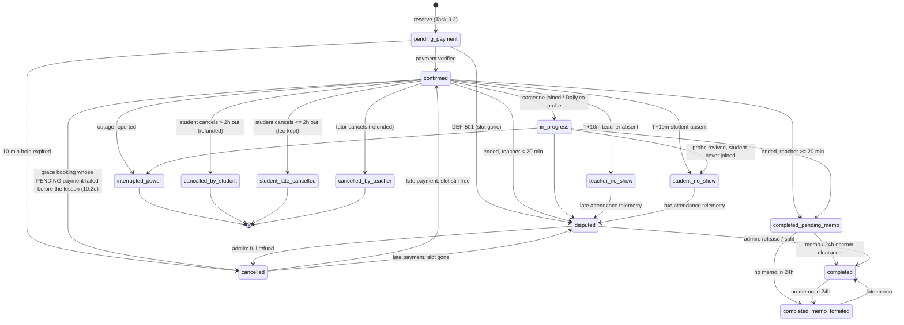

# Booking state machine (Task 9.1)

**Rule:** nothing but `apps/bookings/services/state_machine.py::transition_booking()` may change `Booking.status`.
`tests/test_booking_state_machine.py::TestNoDirectStatusWrites` parses every non-test module and fails the build if one assigns
`x.status = Booking.Status.*` or calls `.update(status=Booking.Status.*)`.

```python
result = transition_booking(booking, Booking.Status.CONFIRMED, actor='system:paypal_webhook', reason='payment TX-1 verified')
if result.changed:          # False when the booking was already in that status -> do side effects only once
    ...
```

* `actor` is a `User` (recorded as `user:<username>` + FK) or a string naming the automated source (`system:<source>`).
* The row is re-read with `SELECT ... FOR UPDATE`; the decision uses the database state, never the caller's possibly stale copy.
* Illegal move -> `InvalidTransition` (HTTP callers answer **409**; background jobs skip the row).
* Same status requested again -> no-op (`changed=False`, no audit row).
* Every real change writes an append-only `BookingStatusChange` (from, to, actor, reason, time) in the same transaction.
* If the save fails (e.g. the active-slot unique index) the in-memory instance is restored and no audit row is kept.

## Lifecycle



## Who makes each move

| Move | Caller |
| :--- | :--- |
| pending -> confirmed / disputed; cancelled -> confirmed / disputed | `payments/services/webhook_handler.py` (verified gateway webhooks) |
| pending -> cancelled | `bookings.tasks.purge_expired_reservations_task` |
| confirmed -> in_progress, no-show -> disputed | `integrations/views/daily_webhooks.py` Daily.co webhook; `audit_attendance_and_noshows_task` (active probe) |
| confirmed/in_progress -> no-show / completed_pending_memo / disputed | `audit_attendance_and_noshows_task` |
| confirmed -> interrupted_power | `ReportOutageView` (the lesson's tutor or staff only) |
| pending_payment -> confirmed (reason `grace_pending_capture`) | `payments/services/grace.py::confirm_grace_booking`, a PayPal capture still PENDING that passed the grace policy (money not yet received; funding `gateway_pending`) |
| confirmed -> cancelled (reason `grace_payment_failed`) | `payments/services/grace.py::on_failed`, only when the pending payment fails BEFORE the lesson start |
| confirmed -> cancelled_by_student / student_late_cancelled / cancelled_by_teacher; pending_payment -> cancelled | `CancelBookingView` -> `services/cancellation.py` (see `CANCELLATION_AND_REFUNDS.md`) |
| -> completed (memo) | `SubmitMemoView` (only the lesson's tutor, only after the attendance job has settled the lesson: completed_pending_memo, completed, completed_memo_forfeited; validated input; flashcards in the same transaction) |
| completed_pending_memo/completed -> forfeited | `enforce_memo_sla_task` (re-checks for a memo under the row lock) |
| completed_pending_memo -> completed | `payments.tasks.release_cleared_escrow_task` |
| disputed -> cancelled / completed | `ResolveDisputeView` (dispute must be OPEN *and* booking DISPUTED; both locked) |

## Adding a new edge

1. Add the edge to `ALLOWED_TRANSITIONS` and to the diagram above, with a comment saying which flow needs it.
2. Call `transition_booking()` from the new flow; use `result.changed` to gate refunds/credits.
3. The all-pairs test (`test_every_pair_behaves_as_the_map_says`) and the reachability test update themselves; add a flow test.

## Bugs fixed while routing the writes through the machine

* `ResolveDisputeView` could be run twice on the same dispute (double credit/ledger) and ignored the booking's state; now locked, 409 on repeat or wrong state.
* A first-ever dispute refund created a credit bundle already holding 1 credit and then added another (**2 credits for one refund**); the old `>= 1` test assertion hid it. Fixed (`_grant_credit`) and the test now asserts `== 1`.
* The Zoom late-telemetry dispute text printed the *new* status (`disputed`) instead of the adjudicated one.
* `enforce_memo_sla_task` could forfeit a lesson (strike + apology credit) whose memo arrived after the candidate query.
* A memo could previously "complete" a merely CONFIRMED (not yet taught) lesson, bypassing attendance checks.

## Known follow-ups

* 9.6 will add confirmed -> cancelled (student/teacher cancellation); 9.7 revisits outage/no-show settlement paths.
* The escrow task moves completed_pending_memo -> completed at 24h, the same moment the memo SLA forfeits an un-memoed lesson; the two jobs overlap (Task 9.9 should decide the intended order).
* Seed/management commands create bookings in arbitrary statuses directly (creation, not transitions) - fine for fixtures.
