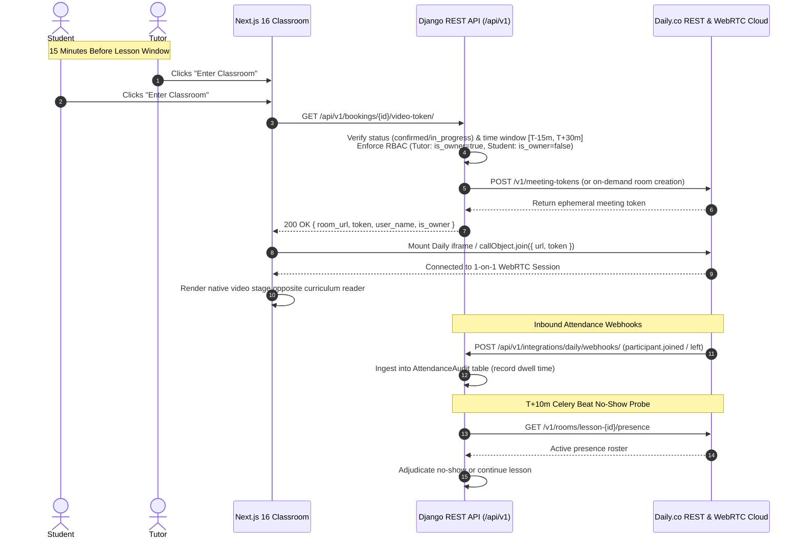

# Daily.co Architectural Migration Plan

## Current implementation status (2026-10-09)

The D1-D4 implementation is now present on `feature/antigravity-repair` and has been integrated with confirmed-booking fulfillment. Rooms use the deterministic `lesson-<booking_id>` name, are created privately with a bounded lesson window, reused safely on retries, and deleted on cancellation/rescheduling. Token issuance requires room readiness, and the T+10 probe prefers Daily presence while preserving `UNKNOWN` on provider failures. The frontend Daily classroom teardown no longer re-enters `leave()` when Daily has already emitted `left-meeting`.

The remaining acceptance boundary is live classroom verification. Daily credentials and the development webhook subscription are configured on Railway development; a confirmed development booking, two authenticated browser sessions, and real `participant.joined` / `participant.left` deliveries are still required. Zoom remains available only as a legacy compatibility path for historical Zoom bookings; it is not used to provision a Daily booking.

**Document ID:** `PLAN-2026-DAILY-CO-MIGRATION`  
**Status:** Approved Architectural Decision (Decision **D-14** Resolved)  
**Date:** October 08, 2026  
**Architect:** Lead Architect & Orchestrator  
**Applicability:** Antigravity (Gemini), Claude Code, Codex, Human Engineering Lead (Anesu MUPESA)

---

## 1. Executive Summary & Rationale

### 1.1 Architectural Evolution: From Zoom Meetings to Daily.co
1. **Initial Spec (Zoom Meetings S2S API):** Required individual licensed host accounts ($15–$20/mo each), creating a fatal concurrency collision where only 1 lesson could occur across the entire platform at any time.
2. **Phase 11 Decision D-9 (Zoom Video SDK):** Solved host seat concurrency by shifting to in-browser WebRTC via `@zoom/videosdk`. However, real-world analysis revealed significant engineering overhead:
   - **Raw `<canvas>` Rendering:** Because Cross-Origin Isolation (`COOP`/`COEP`) cannot be enabled without breaking PayFast and PayPal checkout iframes, Zoom Video SDK must render video onto raw HTML5 `<canvas>` elements. This requires custom dimension math, manual coordinate mapping, and causes frame freezing and audio context issues on mobile Safari (iOS) and Android browsers.
   - **Dual Credential Sets:** Requires maintaining separate Marketplace Key/Secret for join tokens and REST API Key/Secret for backend session probes.
   - **Forced Quarterly Deprecations:** Zoom mandates quarterly minimum client version bumps; failing to release client updates on schedule hard-blocks users from joining lessons.
   - **Complex Webhook Handshake:** Requires two-way CRC challenge handshakes (`endpoint.url_validation`).
3. **Phase 12 Decision D-14 (Daily.co):** Formally adopts **Daily.co** (`@daily-co/daily-js` / `@daily-co/daily-react`) as the definitive video platform.
   - **Native `<video>` and Clean WebRTC:** Native browser audio/video elements with zero canvas math or WebAssembly/SharedArrayBuffer prerequisites.
   - **Drop-in Embedded UI:** Daily Prebuilt embeddable directly inside the left pane of `ClassroomSplitLayout.tsx`.
   - **No Forced Client Sunsetting:** Semantic versioning without rigid 9-month forced client obsolescence.
   - **Preserved Economics:** 10,000 free participant minutes/month, then transparent usage-based billing (~$0.0040 to $0.0090/participant min).

---

## 2. Decoupled Architecture & System Integration

The platform's core scheduling, payments, and financial ledger remain 100% untouched:
- **Scheduling & Booking:** Redis locks, slot availability, and cart checkout are already provider-agnostic.
- **Financial Escrow:** Completion and tutor payout clearance require $\ge 20$ minutes of verified tutor dwell time recorded in `AttendanceAudit`.
- **No-Show Adjudication:** At $T+10\text{m}$, Celery probes room presence via Daily.co's REST API.

---

## 3. Scope of Changes

### 3.1 Backend Touchpoints (`Project-files/backend/`)
1. **Settings (`config/settings/base.py` & `guard.py`):**
   - Add `DAILY_API_KEY`, `DAILY_DOMAIN` (e.g. `sharonesl.daily.co`), `DAILY_WEBHOOK_SECRET`.
   - Deprecate `ZOOM_VIDEO_SDK_*` and `ZOOM_*` credentials in boot guards.
2. **Room & Token Service (`apps/integrations/services/daily.py`):**
   - Issue ephemeral Daily meeting tokens:
     - `room_name: "lesson-<booking_id>"`
     - `nbf: <start_time_utc - 15m>`
     - `exp: <end_time_utc + 30m>`
     - `is_owner: True` (tutors/staff), `False` (students)
     - `enable_recording: "cloud: false"` (per Decision D-8)
3. **Session Token Endpoint (`apps/bookings/video_views.py`):**
   - Returns `{ room_url: "https://sharonesl.daily.co/lesson-<booking_id>", token: "<token>", user_name, is_owner }`.
4. **Presence Probe at $T+10\text{m}$ (`apps/bookings/services/video_session_probe.py`):**
   - Calls `GET https://api.daily.co/v1/rooms/lesson-<booking_id>/presence` to confirm if the tutor is present.
5. **Webhook Ingestion (`apps/integrations/views/daily_webhooks.py`):**
   - Validates `X-Webhook-Signature`.
   - Ingests `participant.joined` and `participant.left` events into `AttendanceAudit`.

### 3.2 Frontend Touchpoints (`Project-files/frontend/`)
1. **Dependencies:**
   - Uninstall `@zoom/videosdk`.
   - Install `@daily-co/daily-js` (for Daily Prebuilt) or `@daily-co/daily-react`.
2. **Classroom Video Stage (`src/components/classroom/DailyClassroom.tsx`):**
   - Replaces `VideoSdkClassroom.tsx` (removes 714 lines of raw canvas rendering, WebAssembly flags, and custom device dropdowns).
   - Embeds Daily Prebuilt within the left pane of `ClassroomSplitLayout.tsx`.
3. **Client Utilities (`src/lib/videoSdk.ts`):**
   - Updated to consume Daily room URLs and tokens cleanly.

---

## 4. Migration Slices (D-14 Execution)

| Slice | Focus | Description |
| :--- | :--- | :--- |
| **D1** | Backend Settings & Client | Daily.co API client, settings guard, and room token generator. |
| **D2** | Token Endpoint & Probe | Update `video-token/` endpoint and $T+10\text{m}$ room presence probe. |
| **D3** | Frontend Daily Classroom | Replace `VideoSdkClassroom.tsx` with Daily Prebuilt integration. |
| **D4** | Webhooks & Telemetry | Daily webhook receiver writing to `AttendanceAudit`. |
| **D5** | Deprecation Cleanup | Remove stale Zoom packages, test suites, and database columns. |
