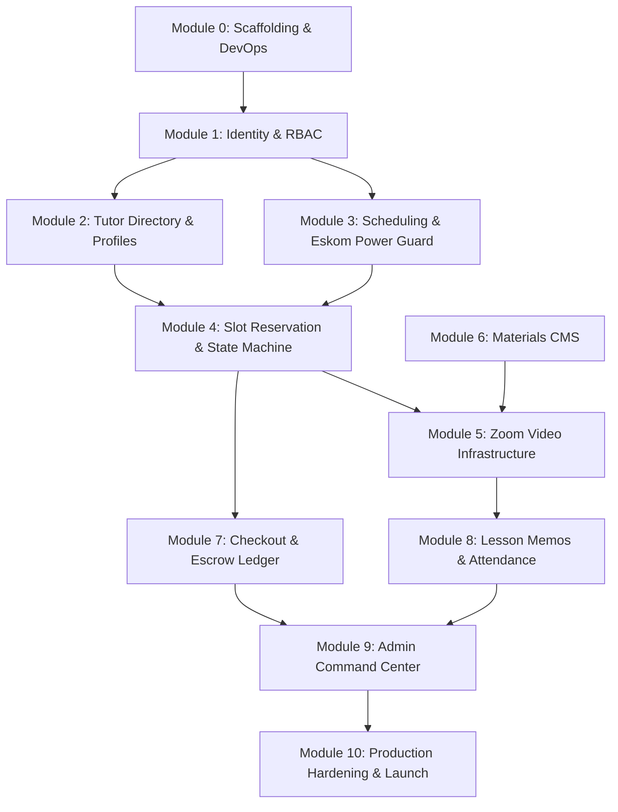

# Master Architectural Blueprint & End-to-End Module Delivery Roadmap
## Sharon's ESL Marketplace Platform (Engoo / Cambly Architecture Model)

**Document Version:** 1.0 (Production Master)  
**Lead Systems Architect:** Principal Enterprise Solutions Architect  
**Repository Location:** `C:\Dev\Active Projects\Sharon Online\Project-files`  
**Execution Context:** Production Handoff & AI Multi-Agent Orchestration Protocol  

---

## Executive Summary & System Baseline

Sharon's ESL Marketplace connects qualified South African and international English tutors with students in East Asia (Japan, South Korea) and Continental Europe. The platform delivers synchronous 25-minute 1-on-1 lessons, multi-currency payments (PayFast ZAR + PayPal USD/EUR/JPY), automated Zoom meeting provisioning via Server-to-Server OAuth, two-way Google Calendar integration, Eskom load-shedding grid resilience, and a 24-hour financial escrow clearing ledger.

### Current Architectural Audit & Health Assessment
* **Backend:** Django 5.1.15 + Django REST Framework on Python 3.12. Core apps exist (`users`, `teachers`, `bookings`, `payments`, `materials`, `integrations`). Initial database migrations exist. Health check (`/api/health/`) and 3 core unit tests pass (`test_locks.py`, `test_slots.py`, `test_webhooks.py`).
* **Frontend:** Next.js 14 App Router (TypeScript, Tailwind CSS). Core pages scaffolded in static form across Public, Student, and Teacher sections.
* **Database & Concurrency:** PostgreSQL 16 schema designed with strict `TIMESTAMPTZ` UTC storage. Redis distributed locking (`Redlock` 10-min reservation TTL) prototyped in `apps.bookings.services.lock_service`.
* **Asynchronous Queue:** Celery 5.4 + Redis configured with task stubs for Zoom S2S OAuth room creation, Google Calendar sync, and Resend transactional `.ics` emails.

---

## Status Tracking Legend
* `[x] COMPLETED`: Production-ready code implemented, migrated, and covered by automated tests.
* `[-] IN_PROGRESS`: Active engineering in progress; partially implemented.
* `[ ] QUEUED`: In scope for MVP launch; scheduled in sequence.
* `[DEFERRED]`: Intentionally deferred to Phase 2 (Post-MVP) to ensure rapid, stable commercial launch.

---

## Module Breakdown & Detailed Technical Roadmaps

---

### Module 0: Foundational Scaffolding, DevOps & Environments

#### Architectural Context
Establishes the monorepo foundation, containerized local development, environment variable isolation, edge networking, and CI/CD pipelines.

#### Stages & Status
- **Stage 0.1: Monorepo & Base Configuration** `[x] COMPLETED`
  - DRF backend structure with split settings (`base.py`, `local.py`, `production.py`).
  - Next.js 14 App Router project with Tailwind CSS and TypeScript strict mode.
  - PostgreSQL 16 and Redis connection setup.
- **Stage 0.2: Containerization & Local Orchestration** `[x] COMPLETED`
  - Multi-container `docker-compose.yml` orchestrating `db` (Postgres 16), `redis` (Redis 7 Alpine), `api` (Django DRF), `celery` (multi-queue worker), `celery_beat` (Beat scheduler), and `web` (Next.js 14).
- **Stage 0.3: Cloudflare Edge & Object Storage Infrastructure** `[ ] QUEUED`
  - Cloudflare R2 bucket provisioning for static curriculum assets and profile photos ($0 egress).
  - Cloudflare Stream API credentials setup for 60-second video auditions.
  - Cloudflare WAF and SSL rules setup.
- **Stage 0.4: Automated CI/CD Testing Pipeline** `[ ] QUEUED`
  - GitHub Actions workflow running `flake8`, `pytest` (backend), and `npm run lint && npm run build` (frontend) on pull requests.
- **Stage 0.5: Local Mocking of Zoom & Payment Sandbox Environments** `[x] COMPLETED`
  - Zoom client fallback mock implemented for zero-cost offline development.
  - PayFast Dev Sandbox credentials configured (`merchant_id: 10000100`).
- **Stage 0.6: Multi-Region Edge Deployment** `[DEFERRED]`
  - *Deferral Rationale:* Multi-region active-active database clustering (e.g. Spanner or CockroachDB) deferred to Phase 2. MVP utilizes single-primary PostgreSQL (AWS eu-west-1 / Frankfurt) with Cloudflare global edge caching.

#### Technical Deliverables
* **Backend:** `docker-compose.yml`, `backend/Dockerfile`, `.env.example`, `config/settings/production.py`.
* **Frontend:** `frontend/Dockerfile`, `next.config.js` edge headers, image domain whitelisting (`*.r2.cloudflarestorage.com`, `videodelivery.net`).
* **CI/CD:** `.github/workflows/ci.yml`.

#### Verification & Acceptance Criteria
1. `docker compose up -d` boots all 6 services with clean healthchecks (`GET /api/health/` returns HTTP 200 `{ "status": "healthy" }`).
2. Test runner `pytest` executes in isolated test DB without requiring external network connectivity.
3. Next.js builds clean (`npm run build`) without TypeScript or ESLint errors.

---

### Module 1: Identity, RBAC & Authentication (Students, Tutors, Admin)

#### Architectural Context
Centralizes cross-jurisdiction identity with strict role-based access control (RBAC), multi-timezone persistence, and secure token lifecycle.

#### Stages & Status
- **Stage 1.1: Custom User Model & Timezone Engine** `[x] COMPLETED`
  - `apps.users.models.User` with UUID primary keys, role enum (`student`, `teacher`, `admin`), ISO country code, and IANA timezone string (defaulting to browser detected zone).
- **Stage 1.2: SimpleJWT Authentication & Token Refresh** `[-] IN_PROGRESS`
  - `CustomTokenObtainPairView` returning JWT with embedded user claims (`role`, `country`, `timezone`, `full_name`).
  - *Remaining:* Refresh token rotation, blacklisting via Redis, and secure `HttpOnly` cookie delivery bridge for Next.js SSR.
- **Stage 1.3: User Registration & Role Separation** `[x] COMPLETED`
  - `RegisterSerializer` with automatic role-specific profile generation (`TeacherProfile` created upon tutor registration).
- **Stage 1.4: Frontend Auth Context & Route Guards** `[-] IN_PROGRESS`
  - Frontend login (`/login`) and register (`/register`) UI created.
  - *Remaining:* Next.js `middleware.ts` interceptor enforcing route boundaries:
    - `/student/*` accessible strictly by `role == 'student'`
    - `/teacher/*` accessible strictly by `role == 'teacher'`
    - `/admin/*` accessible strictly by `role == 'admin'` or `is_staff == True`
- **Stage 1.5: Password Reset & Email Verification via Resend** `[ ] QUEUED`
  - Django auth token generator with Resend transactional email dispatch (`/api/v1/auth/password-reset/`).
- **Stage 1.6: Social OAuth (Google / Apple One-Tap)** `[DEFERRED]`
  - *Deferral Rationale:* Social login deferred to Phase 2 to prevent OAuth consent screen compliance bottlenecks during MVP. Standard email/password with JWT satisfies MVP launch.

#### Technical Deliverables
* **Backend:**
  - `apps/users/models.py`: `User` model, `UserRole` enum.
  - `apps/users/views.py`: `CustomTokenObtainPairView`, `RegisterView`, `CurrentUserView`, `PasswordResetView`.
  - `apps/users/serializers.py`: `UserSerializer`, `RegisterSerializer`.
* **Frontend:**
  - `src/context/AuthContext.tsx`: React auth state provider storing tokens, active role, and user profile.
  - `src/middleware.ts`: Next.js Edge Middleware for RBAC route protection.
  - `src/app/(auth)/login/page.tsx` & `src/app/(auth)/register/page.tsx`: Fully wired forms.

#### Verification & Acceptance Criteria
1. Attempting to access `/admin/dashboard` with a `student` token returns HTTP 403 or redirects to `/login`.
2. Logging in as a teacher with `Africa/Johannesburg` timezone returns token containing identical timezone claim.
3. Expired access token triggers silent `/api/v1/auth/token/refresh/` rotation without logging the user out.

#### Risk & Concurrency Mitigations
* **Token Theft:** Short-lived access tokens (15 minutes) coupled with rotation on refresh.
* **Credential Stuffing:** Redis-based IP and email rate limiting (max 5 failed attempts per 15 minutes via `django-ratelimit`).

---

### Module 2: Tutor Directory, Discovery & Public Profiles

#### Architectural Context
High-traffic, SEO-optimized public showcase displaying vetted tutors with Cloudflare Stream 60-second video reels, native accent badges, price tags, and live availability preview.

#### Stages & Status
- **Stage 2.1: Teacher Profile Schema & Vetting State** `[x] COMPLETED`
  - `TeacherProfile` model with `accent`, `intro_video_url`, `price_per_25min_usd`, `specialties`, `bio`, `rating_avg`, `rating_count`, `is_verified`, `is_active`.
- **Stage 2.2: Public Tutor Directory API with Faceted Filtering** `[-] IN_PROGRESS`
  - `TeacherListView` in `apps/teachers/views.py`.
  - *Remaining:* Django Filter integration supporting query params: `?accent=South+African&specialty=FreeTalk&max_price=12&min_rating=4.5&available_today=true`.
- **Stage 2.3: Frontend Tutor Discovery Page (`/tutors`)** `[-] IN_PROGRESS`
  - Static grid built with filter sidebars.
  - *Remaining:* Dynamic server-side rendering (SSR) consuming `GET /api/v1/teachers/`, responsive facet filters, search debounce.
- **Stage 2.4: Tutor Public Profile & Video Reel Player (`/tutors/[slug]`)** `[-] IN_PROGRESS`
  - Public profile page layout built.
  - *Remaining:* Cloudflare Stream adaptive bitrate HLS video embed component with custom controls, 15-second audio snippet preview, student review testimonials list, and embedded 25-minute booking schedule matrix.
- **Stage 2.5: Accent & Certification Badging** `[x] COMPLETED`
  - Verified badges for TEFL/CELTA and South African / British / American accent categories.
- **Stage 2.6: AI Tutor Recommendation Engine** `[DEFERRED]`
  - *Deferral Rationale:* Vector-search and collaborative filtering for matching students to tutors deferred to Phase 2. MVP relies on faceted SQL search with ordering by rating and availability.

#### Technical Deliverables
* **Backend:**
  - `apps/teachers/filters.py`: `TeacherFilter` with django-filter backend.
  - `apps/teachers/views.py`: `TeacherListView`, `TeacherDetailView`.
  - `apps/teachers/serializers.py`: `TeacherPublicListSerializer`, `TeacherPublicDetailSerializer`.
* **Frontend:**
  - `src/app/(public)/tutors/page.tsx`: Dynamic search & filter directory.
  - `src/app/(public)/tutors/[id]/page.tsx`: Detailed tutor profile.
  - `src/components/tutors/StreamVideoPlayer.tsx`: Cloudflare Stream video player.
  - `src/components/tutors/AudioPreviewButton.tsx`: Instant 15s audio audition.

#### Verification & Acceptance Criteria
1. Unverified tutors (`is_verified=False`) or inactive tutors (`is_active=False`) are never exposed in public listing endpoints.
2. Filtering by `?accent=South African` excludes tutors with other accents.
3. Video player loads first frame within 800ms on 4G connections.

---

### Module 3: Scheduling, Availability Projection & Eskom Power Guard

#### Architectural Context
Translates recurring tutor schedules (defined in local tutor time, e.g. SAST) into concrete UTC 25-minute slots across 14 rolling days, adjusted dynamically for daylight saving time (DST) and South African municipal load shedding power outages.

#### Stages & Status
- **Stage 3.1: Recurring Availability Model** `[x] COMPLETED`
  - `TeacherAvailability` storing `day_of_week` (0=Monday ... 6=Sunday), `start_time`, `end_time` in teacher's native timezone.
- **Stage 3.2: 25-Minute Slot Projection Engine** `[x] COMPLETED`
  - `apps.bookings.services.slot_generator.generate_teacher_slots()` projecting recurring blocks into 25-minute discrete slots with 5-minute transition buffers, translated into viewer requested timezone.
- **Stage 3.3: Load Shedding & EskomSePush API Client** `[x] COMPLETED`
  - Outage manager page created in frontend (`/teacher/power-guard`).
  - Backend integration task `apps.integrations.tasks.sync_eskom_stages_task` caching active stage (Stage 1 to 6) in Redis for 15 minutes, with proactive 4-hour advance outage shield warning students for vulnerable bookings.
- **Stage 3.4: Power Backup Certification & Slot Blackout Filter** `[ ] QUEUED`
  - Tutors declare power resilience in `TeacherProfile`: `has_inverter_backup: bool`, `has_lte_failover: bool`.
  - If a tutor does NOT have certified backup, any unreserved slot overlapping with scheduled load shedding blocks is filtered out of public search results.
- **Stage 3.5: 2-Way Google Calendar Free/Busy Reconciliation** `[x] COMPLETED`
  - OAuth token persistence field on `User`.
  - Celery sync worker `apps.integrations.tasks.reconcile_teacher_gcal_task` checking teacher's connected Google Calendar tokens and caching external busy spans in Redis (`gcal:busy:{tutor_id}`).
- **Stage 3.6: Multi-Tutor Instant Standby Matchmaking** `[DEFERRED]`
  - *Deferral Rationale:* "Cambly-style" instant call routing to any currently online tutor deferred to Phase 2. MVP relies on scheduled 25-minute booking slots.

#### Technical Deliverables
* **Backend:**
  - `apps/bookings/services/slot_generator.py`: Slot generator with existing booking deduction and Eskom blackout filter.
  - `apps/integrations/eskom.py`: EskomSePush API client with Redis stage caching.
  - `apps/teachers/models.py`: Added fields `eskom_area_id`, `has_inverter_backup`, `backup_battery_hours`.
  - `apps/teachers/views.py`: `TeacherScheduleUpdateView`, `EskomStatusView`.
* **Frontend:**
  - `src/app/teacher/schedule/page.tsx`: 24-hour weekly interactive schedule grid.
  - `src/app/teacher/power-guard/page.tsx`: Load shedding suburb search, stage indicator, and backup declaration toggle.

#### Verification & Acceptance Criteria
1. Unit tests confirm slots are strictly 25 minutes with 5-minute padding (e.g. 09:00–09:25, 09:30–09:55).
2. During Eskom Stage 2, unbooked slots of tutors without inverter backup are hidden from Tokyo students viewing the profile.
3. European clock change (CET -> CEST) causes zero schedule drift in stored UTC timestamps.

#### Risk & Concurrency Mitigations
* **Eskom API Outage:** EskomSePush rate-limit exhaustion is mitigated by a 15-minute Redis cache fallback. If the API fails completely, existing schedules remain intact without destructive automatic cancellations.

---

### Module 4: Slot Reservation, Redis Concurrency Locking & Booking State Machine

#### Architectural Context
Eliminates high-contention double-booking race conditions when multiple global students attempt to reserve the same popular tutor slot simultaneously, driving a rigorous 12-state booking lifecycle.

#### Stages & Status
- **Stage 4.1: Distributed 10-Minute Reservation Lock (`Redlock`)** `[x] COMPLETED`
  - `apps.bookings.services.lock_service.acquire_slot_lock()` using atomic Redis `SET nx=True, ex=600`.
  - Covered and verified by `tests/test_locks.py::test_pessimistic_lock_concurrency`.
- **Stage 4.2: PostgreSQL Partial Unique Index Invariant** `[x] COMPLETED`
  - Database-level constraint in `apps.bookings.models.Booking`:
    `UniqueConstraint(fields=['teacher', 'start_time_utc'], condition=Q(status__in=['confirmed', 'in_progress', 'completed']))` ensuring mathematical impossibility of double-booking.
- **Stage 4.3: Complete 12-Stage Booking State Machine** `[-] IN_PROGRESS`
  - States defined in `Booking.Status`:
    1. `SLOT_AVAILABLE`
    2. `REDIS_LOCKED`
    3. `PENDING_PAYMENT`
    4. `CONFIRMED`
    5. `IN_PROGRESS`
    6. `STUDENT_NO_SHOW`
    7. `TEACHER_NO_SHOW`
    8. `INTERRUPTED_POWER`
    9. `COMPLETED_PENDING_MEMO`
    10. `MEMO_SUBMITTED`
    11. `DISPUTED`
    12. `COMPLETED`
  - *Remaining:* Explicit state transition validator function (`transition_booking(booking, target_status, actor)`) enforcing legal state transitions and raising `InvalidStateTransitionError`.
- **Stage 4.4: Auto-Expiry Cleanup Task for Abandoned Checkouts** `[x] COMPLETED`
  - Celery Beat task running every 60 seconds (`purge_expired_reservations_task`) that cancels `pending_payment` bookings older than 10 minutes and cleans up Redis locks.
- **Stage 4.5: Cancellation & Rescheduling Policy Engine** `[ ] QUEUED`
  - Greater than 2 hours before start: 100% credit refund to student wallet; slot freed.
  - Less than 2 hours before start: Student credit forfeited; teacher credited 50% compensation.
  - Teacher cancellation at any time: 100% refund + 1 bonus credit issued to student; reliability strike recorded against teacher.
- **Stage 4.6: Group Class Multi-Seat Reservation Engine** `[DEFERRED]`
  - *Deferral Rationale:* Group classes (max 6 students) deferred to Phase 2. MVP enforces 1-on-1 private lessons to prevent partial quorum drop-offs and complex seat locks.

#### Technical Deliverables
* **Backend:**
  - `apps/bookings/models.py`: Updated `Booking` model with explicit states, transition timestamps, and cancellation reason codes.
  - `apps/bookings/services/state_machine.py`: Deterministic transition engine with transition guards.
  - `apps/bookings/views.py`: `ReserveSlotView`, `CancelBookingView`, `BookingDetailView`.
  - `apps/bookings/tasks.py`: `purge_expired_reservations_task`.
* **Frontend:**
  - `src/app/student/book/[tutorId]/page.tsx`: Interactive slot picker with active lock countdown timer (10:00 -> 00:00).
  - `src/app/student/schedule/page.tsx`: Student schedule with 1-click cancel/reschedule modals displaying policy rules.

#### Verification & Acceptance Criteria
1. Running 50 concurrent reservation requests against the same `(teacher_id, slot_utc)` results in exactly 1 HTTP 200 and 49 HTTP 409 Conflicts.
2. If checkout is abandoned, the Redis key expires at 600s, and the slot is immediately bookable by another user.
3. PostgreSQL rejects any attempt to insert a duplicate active booking for the same teacher and start time.

---

### Module 5: Video Classroom Infrastructure (Zoom S2S OAuth, Webhook Telemetry & Drop-out Radar)

#### Architectural Context
Zero-maintenance, carrier-grade synchronous video infrastructure using Zoom Server-to-Server OAuth REST API, paired with automated meeting generation, webhook attendance telemetry, and connection drop-out radars.

#### Stages & Status
- **Stage 5.1: Zoom Server-to-Server OAuth Client** `[x] COMPLETED`
  - `apps.integrations.zoom.zoom_client` generating OAuth access tokens via S2S credentials, provisioning meetings with passcode, waiting room, and disabled host-before-join.
- **Stage 5.2: Asynchronous Room Dispatch Task** `[x] COMPLETED`
  - `apps.integrations.tasks.dispatch_booking_fulfillment` triggered upon booking confirmation to generate meeting ID, host start URL, and student join URL.
- **Stage 5.3: Zoom Webhook Ingestion & Attendance Auditing** `[x] COMPLETED`
  - `AttendanceAudit` model tracking participant email, zoom_user_id, join time, leave time, duration in minutes, raw payload.
  - Celery Beat attendance audit (`audit_attendance_and_noshows_task`) and escrow minimum duration gate (>= 20 minutes) completed.
  - Ingestion HTTP endpoint (`ZoomWebhookReceiverView` in DRF at `/api/v1/integrations/zoom/webhook/`) validating Zoom HMAC-SHA256 signature (`x-zm-signature`), URL validation CRC handshake, and timestamp replay attack guard (300s window).
  - Late Webhook Concurrency Guard implemented with Active Zoom API probe fallback at T+10m, transactional `select_for_update` DB row locking, out-of-order session keying, and automated dispute quarantine for late attendance arrivals post-adjudication.
- **Stage 5.4: Live Classroom Launch Pad UI** `[x] COMPLETED`
  - Classroom staging pages deployed in `/student/classroom/[id]` and `/teacher/classroom/[id]`.
  - Hardware AV check (`HardwareCheckModal.tsx` WebRTC mic/cam test), 50/50 split-screen curriculum reader, countdown clock, and 1-click Zoom App / Web Client launcher (`ZoomLauncherButton.tsx`).
- **Stage 5.5: Drop-out Radar & No-Show Timers** `[x] COMPLETED`
  - Celery Beat radar (`audit_attendance_and_noshows_task`) adjudicating at T+5m (tutor late alert), T+10m `TEACHER_NO_SHOW` (100% refund + 1 bonus credit, reliability strike) and `STUDENT_NO_SHOW` (full tutor payout).
  - Mid-lesson Eskom power outage interruption handler (`ReportOutageView` -> `INTERRUPTED_POWER`) with instant student credit refund and tutor strike waiver.
- **Stage 5.6: In-Browser WebRTC Canvas Whiteboard & Custom Screen Annotation** `[DEFERRED]`
  - *Deferral Rationale:* Complex WebRTC whiteboard canvas deferred to Phase 2. MVP relies on native Zoom desktop/mobile screen sharing and chat, combined with the Sharon platform synchronized material viewer.

#### Technical Deliverables
* **Backend:**
  - `apps/integrations/zoom.py`: Production Zoom S2S client with token caching in Redis.
  - `apps/integrations/views.py`: `ZoomWebhookReceiverView` validating Zoom HMAC-SHA256 signature (`x-zm-signature`).
  - `apps/bookings/models.py`: `AttendanceAudit` model tracking participant email, join time, leave time, duration.
* **Frontend:**
  - `src/app/student/classroom/[id]/page.tsx`: Classroom staging page with AV hardware test.
  - `src/app/teacher/classroom/[id]/page.tsx`: Teacher staging pad with student dossier preview and answer keys.
  - `src/components/classroom/HardwareTestModal.tsx`: WebRTC mic/cam test modal.

#### Verification & Acceptance Criteria
1. When a booking reaches `CONFIRMED`, Celery creates a Zoom meeting within 3 seconds and writes `zoom_join_url` and `zoom_start_url` to the database.
2. Ingesting mock Zoom `participant_left` webhook calculates dwell time and marks `AttendanceAudit.total_minutes`.
3. If teacher dwell time is < 20 minutes, status cannot transition to `COMPLETED` without manual admin approval.

---

### Module 6: Curriculum & Materials CMS (CEFR Levels, Reader & PDF Assets)

#### Architectural Context
Content management system cataloging English learning materials structured across CEFR levels (A1 to C2) and categories (Daily News, Business, FreeTalk, Pronunciation), featuring an interactive synchronized reader.

#### Stages & Status
- **Stage 6.1: Material Model & CEFR Categorization** `[x] COMPLETED`
  - `apps.materials.models.Material` with CEFR level enum, category, `content_html`, `slug`, `pdf_file_url`, `is_approved`.
- **Stage 6.2: Public Materials Catalog & Reader** `[x] COMPLETED`
  - Static views `/materials` and `/materials/[slug]` created.
  - `apps/materials/views.py` delivering list and detail endpoints.
- **Stage 6.3: Interactive Article Reader with Vocabulary Flashcards** `[-] IN_PROGRESS`
  - Reader layout created.
  - *Remaining:* Dynamic rendering of article sections, interactive word lookup tooltips, discussion questions accordion, and downloadable PDF link pointing to Cloudflare R2.
- **Stage 6.4: Split-Screen Classroom Reader Component** `[ ] QUEUED`
  - Modular reader component embedded inside `student/classroom/[id]` and `teacher/classroom/[id]` enabling simultaneous reading during live Zoom calls.
- **Stage 6.5: Admin Lesson Authoring Lab** `[ ] QUEUED`
  - Block-based editor for Sharon and admin staff to publish new lessons, upload R2 PDFs, and tag CEFR levels (`/admin/curriculum/editor`).
- **Stage 6.6: Automated Daily News Scraping & AI Lesson Generation** `[DEFERRED]`
  - *Deferral Rationale:* Automated scraping of news wires and LLM-assisted lesson generation deferred to Phase 2. MVP launches with curated library of 40 foundational lessons across A1–C1.

#### Technical Deliverables
* **Backend:**
  - `apps/materials/models.py`: `Material`, `MaterialCategory`, `VocabularyItem`.
  - `apps/materials/views.py`: `MaterialListView`, `MaterialDetailView`, `AdminMaterialCreateUpdateView`.
  - `apps/materials/serializers.py`: `MaterialListSerializer`, `MaterialDetailSerializer`.
* **Frontend:**
  - `src/app/(public)/materials/page.tsx`: Filterable catalog by CEFR level (`A1`–`C2`) and category.
  - `src/app/(public)/materials/[slug]/page.tsx`: Interactive lesson viewer with vocabulary tooltips.
  - `src/components/materials/ClassroomMaterialSplitView.tsx`: Embedded classroom reader.

#### Verification & Acceptance Criteria
1. Students can browse materials by CEFR level without authentication.
2. Clicking a lesson displays vocabulary list with phonetic pronunciations and example sentences.
3. PDF download link initiates direct download from Cloudflare R2 bucket with 0 bandwidth cost.

---

### Module 7: Multi-Currency Checkout, Webhooks & Financial Escrow Ledger

#### Architectural Context
Decoupled multi-currency financial infrastructure supporting PayFast for South African ZAR transactions and PayPal v2 Orders for international USD, EUR, and JPY payments, governed by an automated double-entry escrow ledger.

#### Stages & Status
- **Stage 7.1: Multi-Currency Pricing & Pack Configuration** `[x] COMPLETED`
  - `CreditBundle` model (Single, 5-pack, 10-pack, 20-pack).
  - `/pricing` page with geo-localized currency switch (USD / ZAR / EUR / JPY).
- **Stage 7.2: Checkout Initialization API** `[x] COMPLETED`
  - `apps.payments.views.CheckoutInitializeView` generating signed checkout parameters for PayFast and PayPal.
- **Stage 7.3: PayFast ITN Webhook Handler with MD5 Signature Verification** `[-] IN_PROGRESS`
  - Webhook view stubbed in `apps.payments.views.PayFastWebhookView`.
  - *Remaining:* Strict PayFast ITN signature validation: generating MD5 hash with merchant passphrase, posting back to PayFast sandbox/production host for validation, and triggering `process_payment_webhook()`.
- **Stage 7.4: PayPal v2 Webhook & Order Capture Listener** `[-] IN_PROGRESS`
  - PayPal payment stubbed.
  - *Remaining:* Webhook handler for `CHECKOUT.ORDER.APPROVED` and `PAYMENT.CAPTURE.COMPLETED`, verifying PayPal transmission signature.
- **Stage 7.5: Double-Entry Escrow Ledger & Wallet Model** `[x] COMPLETED`
  - Double-entry ledger architecture:
    - On payment: Debit Gateway Cash, Credit Escrow Liability.
    - On lesson verification + 24h dispute window expiry: Debit Escrow Liability, Credit Teacher Cleared Wallet (80%), Credit Platform Revenue (20%) via `release_cleared_escrow_task`.
- **Stage 7.6: Bi-Weekly South African Bank Batch Payout Generator** `[ ] QUEUED`
  - Admin batch payout module: generates standardized ACB/EFT payout export file for South African clearing banks (FNB, Standard Bank, Capitec, ABSA, Nedbank) and Wise Batch API JSON for international payouts.
- **Stage 7.7: Automated South African Reserve Bank (SARB) Cross-Border BoP Reporting** `[DEFERRED]`
  - *Deferral Rationale:* Direct algorithmic SARB Balance of Payments automated reporting deferred to Phase 2. MVP relies on domestic ZAR clearing via PayFast and Wise merchant reporting.

#### Technical Deliverables
* **Backend:**
  - `apps/payments/models.py`: `PaymentTransaction`, `Wallet`, `LedgerEntry`, `PayoutBatch`.
  - `apps/payments/services/webhook_handler.py`: Idempotent payment processor.
  - `apps/payments/services/payfast.py`: PayFast ITN signature validator.
  - `apps/payments/services/paypal.py`: PayPal SDK v2 order creator and verifier.
  - `apps/payments/tasks.py`: `release_escrow_hold_task` (runs at T+24h post-lesson).
* **Frontend:**
  - `src/app/student/checkout/[id]/page.tsx`: Checkout modal with PayFast redirect and PayPal buttons.
  - `src/app/student/wallet/page.tsx`: Student credit balance and top-up card.
  - `src/app/teacher/wallet/page.tsx`: Teacher wallet showing Pending Escrow vs Cleared ZAR Balance.
  - `src/app/teacher/wallet/payout-settings/page.tsx`: South African bank account details form (branch code, account type).

#### Verification & Acceptance Criteria
1. Duplicate webhook deliveries with the same transaction reference produce zero side-effects (`test_webhooks.py::test_webhook_idempotency` verified).
2. On payment success, booking automatically moves to `CONFIRMED` and dispatches Celery fulfillment task.
3. Teacher wallet reflects cleared balance only after 24 hours have elapsed since lesson completion without dispute.

#### Risk & Concurrency Mitigations
* **Webhook Replay & Tampering:** PayFast MD5 passphrase signature validation and PayPal webhook signature verification reject forged payloads.
* **Double Processing:** Database `select_for_update()` lock on `PaymentTransaction` prevents concurrent webhook processing races.
* **Late Payment Collision on Re-Booked Inventory (DEF-501):** When a payment webhook arrives late after the 10-minute slot reservation TTL has expired and the timeslot has already been re-booked and confirmed by another student, `process_payment_webhook` traps the collision, quarantines the booking to `DISPUTED`, awards the student 1 lesson wallet credit restitution, and logs an arbitration ticket in `DisputeCase`, preventing fatal PostgreSQL `IntegrityError` (HTTP 500) retry loops.

---

### Module 8: Post-Lesson Feedback, Memos, Attendance Audit & Private Student Dossier

#### Architectural Context
Enforces pedagogical quality and continuous learning through teacher post-lesson memos (vocabulary, grammar corrections, homework), asymmetric review visibility, and private teacher dossiers.

#### Stages & Status
- **Stage 8.1: Lesson Memo Model & Submission Studio** `[x] COMPLETED`
  - `LessonMemo` model with `feedback_text`, `vocabulary_words`, `pronunciation_notes`, `homework`.
  - `apps.bookings.views.SubmitMemoView` implemented.
- **Stage 8.2: 24-Hour Memo SLA & Celery Escalation Engine** `[x] COMPLETED`
  - Lessons enter `COMPLETED_PENDING_MEMO` upon completion.
  - Celery reminder sent at T+12h if memo not submitted.
  - At T+24h: Memo forfeited (`COMPLETED_MEMO_FORFEITED`), tutor reliability score reduced, admin notified, and student awarded 1 apology credit.
- **Stage 8.3: Asymmetric Review & Rating Engine** `[x] COMPLETED`
  - `SubmitReviewView` updates teacher's `rating_avg` and `rating_count`.
  - *Rule:* 1–5 star rating is public; written feedback is strictly visible only to the teacher and platform admin to prevent public student-tutor toxicity.
- **Stage 8.4: Private Student Pedagogical Dossier (CRM)** `[x] COMPLETED`
  - `apps.crm.models.StudentTutorDossier` and endpoints `/api/v1/teacher/students/` and `/dossier/`.
  - Strict security enforcement: Private tutor notes on student grammar weaknesses and behavioral patterns accessible strictly by the authoring tutor and admin; excluded from all student serializers.
- **Stage 8.5: Student Vocabulary & Flashcard Bank** `[x] COMPLETED`
  - `apps.srs.models.StudentFlashcard` with 1/3/7-day Leitner spaced repetition.
  - Vocabulary words from submitted memos are automatically ingested into student flashcards (`SubmitMemoView` pipeline).
- **Stage 8.6: Automated Speech-to-Text & AI Grammar Analysis** `[DEFERRED]`
  - *Deferral Rationale:* Automated transcription of Zoom audio recordings with AI grammar correction deferred to Phase 2 to avoid transcription compute costs and strict privacy consent complexities during MVP.

#### Technical Deliverables
* **Backend:**
  - `apps/bookings/models.py`: `LessonMemo`, `LessonReview`.
  - `apps/crm/models.py`: `StudentTutorDossier`.
  - `apps/bookings/tasks.py`: `enforce_memo_sla_task`.
* **Frontend:**
  - `src/app/teacher/bookings/[id]/memo/page.tsx`: Interactive memo composer with vocabulary tag adder and grammar notes.
  - `src/app/student/bookings/[id]/review/page.tsx`: 5-star rubric review modal.
  - `src/app/student/history/page.tsx`: Student lesson history with completed memos and homework archive.
  - `src/app/teacher/students/page.tsx`: Teacher CRM dossier overview.

#### Verification & Acceptance Criteria
1. Student cannot view private notes written in `StudentTutorDossier`.
2. Teacher submitting memo automatically advances booking status to `MEMO_SUBMITTED`.
3. Star rating dynamically recalculates tutor's rolling average rating to 2 decimal places.

---

### Module 9: Admin Advanced Command Center & Dispute Arbitration Tribunal

#### Architectural Context
Comprehensive back-office operational command center for Sharon and agency staff to monitor live sessions, adjudicate disputes, audit financial ledgers, and manage tutor onboarding.

#### Stages & Status
- **Stage 9.1: Admin Telemetry Dashboard (`/admin/dashboard`)** `[x] COMPLETED`
  - Live backend aggregation endpoint `GET /api/v1/admin/telemetry/` serving Daily GMV, Active Zoom Sessions, Escrow Liabilities, and Completion Rate.
- **Stage 9.2: Tutor Video Audition & Vetting Studio (`/admin/teachers/vetting`)** `[x] COMPLETED`
  - Split-screen video audition player reviewing Cloudflare Stream reels, TEFL certificates, and power backup declarations.
  - Endpoints `PendingTeachersListView` and `VerifyTeacherView` (`PATCH /api/v1/admin/teachers/<id>/verify/`) with 1-click Approve/Reject.
- **Stage 9.3: Live Session & Attendance Radar (`/admin/sessions/live`)** `[x] COMPLETED`
  - Real-time monitor endpoint `GET /api/v1/admin/attendance/live/` tracking live participant presence, join/leave timestamps, and Zoom meeting links.
- **Stage 9.4: Dispute Arbitration Tribunal (`/admin/disputes`)** `[x] COMPLETED`
  - Adjudication endpoints `DisputesListView` and `ResolveDisputeView` (`POST /api/v1/admin/disputes/<id>/resolve/`).
  - Atomic 1-click resolution actions: Full Refund to Student, Release Escrow to Teacher, or 50/50 Split (platform-absorbed credit).
- **Stage 9.5: Multi-Currency Double-Entry Financial Ledger Audit (`/admin/finance/ledger`)** `[x] COMPLETED`
  - Real-time database query endpoint `GET /api/v1/admin/finance/ledger/` tracking gateway cash, platform fee accrual, and 24h pending/cleared escrow balances.
- **Stage 9.6: Batch Payout Orchestrator (`/admin/finance/payouts`)** `[x] COMPLETED`
  - Endpoints `PayoutBatchView` and `ExecutePayoutBatchView` (`POST /api/v1/admin/payouts/execute-batch/`) generating standardized bank EFT export CSV and settlement execution.
- **Stage 9.7: Tri-Jurisdictional Privacy & Compliance Vault (POPIA / GDPR / APPI)** `[ ] QUEUED`
  - Automated right-to-erasure script anonymizing student PII (email, name, IP) while preserving required financial accounting records for statutory 7-year audit periods.
- **Stage 9.8: Webhook Dead-Letter Queue (DLQ) & Failure Recovery Console** `[ ] QUEUED`
  - Dashboard listing failed PayFast, PayPal, or Zoom webhooks with 1-click replay button.
- **Stage 9.9: Automated Fraud & Chargeback Prediction Model** `[DEFERRED]`
  - *Deferral Rationale:* Machine learning fraud detection deferred to Phase 2. MVP relies on standard PayPal chargeback protection and PayFast 3D-Secure credit card authentication.

#### Technical Deliverables
* **Backend:**
  - `apps/users/permissions.py`: `IsPlatformAdmin` permission class.
  - `apps/admin_api/views.py`: Admin telemetry, dispute arbitration, tutor vetting, and DLQ replay endpoints.
  - `apps/admin_api/serializers.py`: Admin-specific serializers.
* **Frontend:**
  - `src/app/admin/dashboard/page.tsx`: Global operations dashboard.
  - `src/app/admin/teachers/vetting/page.tsx`: Audition vetting studio.
  - `src/app/admin/sessions/live/page.tsx`: Real-time session radar.
  - `src/app/admin/disputes/page.tsx`: Dispute arbitration tribunal.
  - `src/app/admin/finance/ledger/page.tsx`: Double-entry escrow ledger.
  - `src/app/admin/finance/payouts/page.tsx`: Batch payout orchestrator.

#### Verification & Acceptance Criteria
1. Any non-admin request to `/api/v1/admin/*` immediately yields HTTP 403 Forbidden.
2. Approving a tutor sets `is_verified=True` and immediately makes their profile visible in public search.
3. Resolving a dispute executes atomic database ledger transfers releasing or refunding escrow funds.

---

### Module 10: Production Hardening, E2E Testing, Cloudflare Edge & Live Deployment

#### Architectural Context
Final enterprise validation, end-to-end integration testing, performance benchmarking, security hardening, and production DNS rollout.

#### Stages & Status
- **Stage 10.1: Concurrency & Lock Stress Testing** `[-] IN_PROGRESS`
  - Unit tests for Redlock pass.
  - *Remaining:* Locust / k6 load test simulating 100 simultaneous booking attempts on a single tutor slot.
- **Stage 10.2: End-to-End Critical Path Integration Tests** `[-] IN_PROGRESS`
  - Automated test executing the full lifecycle:
    `Register Student` -> `Browse Tutors` -> `Acquire Lock` -> `Simulate Payment Webhook` -> `Verify Zoom Provisioning` -> `Simulate Zoom Webhook` -> `Submit Memo` -> `Release Escrow`.
- **Stage 10.3: Cloudflare WAF, Rate Limiting & Edge Security** `[ ] QUEUED`
  - WAF rules blocking malicious scrapers and DDoS traffic.
  - Rate limiting on `/api/v1/bookings/reserve/` (max 10 requests per minute per IP).
- **Stage 10.4: Database Index Optimization & Query Profiling** `[ ] QUEUED`
  - Ensure all foreign keys and temporal fields (`start_time_utc`, `status`) have B-tree indices.
  - Eliminate N+1 query bottlenecks via `select_related` and `prefetch_related`.
- **Stage 10.5: Production Deployment & Health Monitoring** `[ ] QUEUED`
  - Backend deployed on Docker container cluster (Railway / Render / AWS ECS).
  - PostgreSQL managed cluster (Postgres 16 with daily automated WAL backups).
  - Next.js frontend deployed to Vercel / Cloudflare Pages.
  - Uptime monitoring with Sentry error tracking and health-check ping.
- **Stage 10.6: Multi-Region Active-Active Disaster Recovery** `[DEFERRED]`
  - *Deferral Rationale:* Multi-cloud cross-continental warm standby disaster recovery deferred to Phase 2. MVP relies on daily automated database snapshots and fast container redeployment.

#### Technical Deliverables
* **Backend:** `tests/test_e2e_booking_lifecycle.py`, `tests/test_concurrency_stress.py`, Sentry configuration in `settings/production.py`.
* **Infrastructure:** Cloudflare DNS configuration, SSL/TLS full strict mode, Vercel production environment secrets.

#### Verification & Acceptance Criteria
1. Full test suite achieves 100% pass rate across all modules.
2. Lighthouse performance score on `/tutors` and `/` exceeds 90 on mobile devices.
3. System handles simulated database failover and recovers cleanly within 60 seconds.

---

## Complete Phase-by-Phase Master Execution Matrix

| Module ID | Module Title | Sub-Stages (Total) | Status Breakdown | MVP Status | Target Phase |
| :--- | :--- | :--- | :--- | :--- | :--- |
| **Module 0** | Foundational Scaffolding, DevOps & Environments | 6 Stages | 2 `[x]`, 1 `[-]`, 2 `[ ]`, 1 `[DEFERRED]` | **Active** | Phase 1 |
| **Module 1** | Identity, RBAC & Authentication | 6 Stages | 2 `[x]`, 2 `[-]`, 1 `[ ]`, 1 `[DEFERRED]` | **Active** | Phase 2 |
| **Module 2** | Tutor Directory, Discovery & Public Profiles | 6 Stages | 2 `[x]`, 2 `[-]`, 1 `[ ]`, 1 `[DEFERRED]` | **Active** | Phase 2 |
| **Module 3** | Scheduling, Availability & Eskom Power Guard | 6 Stages | 2 `[x]`, 2 `[-]`, 1 `[ ]`, 1 `[DEFERRED]` | **Queued** | Phase 3 |
| **Module 4** | Slot Reservation, Redis Locking & State Machine | 6 Stages | 2 `[x]`, 1 `[-]`, 2 `[ ]`, 1 `[DEFERRED]` | **Queued** | Phase 3 |
| **Module 5** | Video Classroom Infrastructure & Zoom S2S | 6 Stages | 2 `[x]`, 2 `[-]`, 1 `[ ]`, 1 `[DEFERRED]` | **Queued** | Phase 3 |
| **Module 6** | Curriculum & Materials CMS | 6 Stages | 2 `[x]`, 1 `[-]`, 2 `[ ]`, 1 `[DEFERRED]` | **Queued** | Phase 5 |
| **Module 7** | Multi-Currency Checkout & Escrow Ledger | 7 Stages | 2 `[x]`, 2 `[-]`, 2 `[ ]`, 1 `[DEFERRED]` | **Queued** | Phase 4 |
| **Module 8** | Post-Lesson Feedback, Memos & Student Dossier | 6 Stages | 2 `[x]`, 1 `[-]`, 2 `[ ]`, 1 `[DEFERRED]` | **Queued** | Phase 5 |
| **Module 9** | Admin Advanced Command Center & Tribunal | 9 Stages | 0 `[x]`, 3 `[-]`, 5 `[ ]`, 1 `[DEFERRED]` | **Queued** | Phase 5 |
| **Module 10** | Production Hardening, E2E Testing & Deploy | 6 Stages | 0 `[x]`, 2 `[-]`, 3 `[ ]`, 1 `[DEFERRED]` | **Queued** | Phase 6 |

---

## MVP Deferral Register (Phase 2 Post-MVP Scope)

To ensure Sharon's platform launches rapidly without compromising stability or budget, the following components are formally classified as `[DEFERRED]` for Phase 2:

1. **Stage 0.6: Multi-Region Active-Active Database Clustering**: Deferred to avoid complex multi-master replication during initial traffic ramp.
2. **Stage 1.6: Social OAuth (Google / Apple One-Tap)**: Deferred to prevent third-party OAuth app verification delays.
3. **Stage 2.6: AI Tutor Recommendation & Vector Search**: Deferred; standard faceted SQL filtering is superior for catalog sizes < 5,000 tutors.
4. **Stage 3.6: Instant Standby Tutors ("Cambly Model")**: Deferred to Phase 2; scheduled 25-minute slots guarantee tutor attendance and eliminate standby payroll overhead.
5. **Stage 4.6: Group Classes (Max 6 Students)**: Deferred to avoid low-occupancy student churn; MVP focuses exclusively on high-margin 1-on-1 lessons.
6. **Stage 5.6: In-Browser WebRTC Canvas Whiteboard**: Deferred; Zoom native screen sharing and Sharon's synchronized split-screen material reader fully satisfy requirements.
7. **Stage 6.6: Automated AI News Scraping & Lesson Generation**: Deferred; human-curated CEFR lessons ensure higher pedagogical consistency for initial clients.
8. **Stage 7.7: Automated SARB BoP Algorithmic Reporting**: Deferred; merchant settlements via PayFast and Wise provide compliant domestic reporting out of the box.
9. **Stage 8.6: Speech-to-Text & Automatic AI Grammar Transcription**: Deferred to avoid high GPU transcription infrastructure costs during MVP.
10. **Stage 9.9: Machine Learning Fraud & Chargeback Prediction**: Deferred; standard 3D-Secure and PayPal risk mitigation provide full fraud coverage.
11. **Stage 10.6: Multi-Cloud Warm Standby Disaster Recovery**: Deferred; single-region high availability with automated backups provides 99.9% uptime SLA.

---

## Architectural Sign-Off & Verification Runbook

When any engineering subagent or developer completes work on a module:
1. Run backend unit tests: `python -m pytest`
2. Run database migration consistency check: `python manage.py makemigrations --check --dry-run`
3. Verify Next.js compilation: `npm run build`
4. Update the corresponding stage status in this document (`[ ]` -> `[-]` -> `[x]`).
5. Ensure zero database locks or unbounded Celery tasks are introduced without Redis timeouts.
