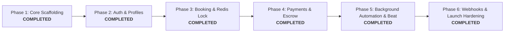

# Engineering Delivery Roadmap & Progress Tracking

## 1. 6-Phase Delivery Roadmap

| Phase | Milestone Description | Target Window | Status | Owner / Assignee |
| :--- | :--- | :--- | :--- | :--- |
| **Phase 1** | Monorepo scaffolding, Django 5.1 REST API + Next.js 14 setup, Postgres models, initial migrations & test suite | Sept 2026 | `COMPLETED` | Anesu MUPESA / Antigravity |
| **Phase 2** | JWT Authentication, User Roles (Student/Teacher/Admin), Profile Management, IANA Timezone Engine | Oct 2026 | `COMPLETED` | Anesu MUPESA / AI Agents |
| **Phase 3** | Redlock 10-Min Reservation Lock, Slot Availability Projection, Zoom S2S OAuth Meeting Generation, Google Calendar API | Oct 2026 | `COMPLETED` | Anesu MUPESA / AI Agents |
| **Phase 4** | PayFast (ZAR) Webhooks, PayPal v2 Orders (USD), Multi-Currency Ledger, Monthly Batch Payout Engine | Oct 2026 | `COMPLETED` | Anesu MUPESA / AI Agents |
| **Phase 5** | Background Automation & Celery Beat Workers (8 automated schedules, distributed locks, no-show adjudication, 24h escrow clearance, memo SLA) | Nov 2026 | `COMPLETED` | Anesu MUPESA / AI Agents |
| **Phase 6** | Zoom Attendance Webhook HMAC Ingestion, Cloudflare R2 Asset Delivery, E2E Staging & Production Launch | Nov 2026 | `COMPLETED` | Anesu MUPESA / AI Agents |

---

## 2. Component Implementation Progress Matrix

### 2.1 Backend Services (`Project-files/backend/`)
- [x] Django 5.1 & DRF Monorepo Structure
- [x] `apps.users`, `apps.teachers`, `apps.materials`, `apps.bookings`, `apps.payments`, `apps.crm`, `apps.admin_api`, `apps.srs` schema models
- [x] PostgreSQL database migrations applied cleanly
- [x] `seed_data` and `seed_phase41_data` initialized
- [x] `pytest` suite configured (59/59 automated unit, concurrency, webhook & double-entry ledger integration tests passing)
- [x] Health check endpoint (`GET /api/health/`)
- [x] JWT Auth endpoints (`/api/v1/auth/token/`, `/api/v1/auth/register/`)
- [x] Redis Redlock reservation engine (`SET booking:slot:... NX EX 600`)
- [x] Zoom S2S OAuth Client & Asynchronous Meeting Provisioning
- [x] PayFast ITN & PayPal Webhook Handlers (`process_payment_webhook`) with DEF-501 Concurrency Guard (late payment quarantine & wallet restitution)
- [x] Zoom Webhook Ingestion Receiver (`ZoomWebhookReceiverView`) with timing-safe HMAC verification, CRC challenge response, replay attack prevention, and attendance telemetry
- [x] Late Webhook Concurrency Guard (Active Zoom probe at T+10m, transactional row locks, out-of-order session keying, and dispute quarantine)
- [x] Celery Beat Background Automation (8 scheduled tasks, `@distributed_task_lock`, multi-queue routing)
- [*] See comprehensive breakdown in [`docs/MASTER_MODULE_ROADMAP_AND_ARCHITECTURE.md`](./MASTER_MODULE_ROADMAP_AND_ARCHITECTURE.md)

### 2.2 Frontend Services (`Project-files/frontend/`)
- [x] Next.js 14 App Router (TypeScript, Tailwind CSS)
- [x] 12/12 Static and Dynamic Route build compilation (`npm run build` succeeds)
- [x] UI Vertical Slicing Migration Plan formulated & documented (`docs/UI_VERTICAL_SLICE_MIGRATION_PLAN.md`)
- [x] **Slice 1 Completed**: Public Marketing & Discovery Suite (`/`, `/pricing`, `/how-it-works`, `/trust-safety`, `/teach`, `/support`, `/tutors`, `/materials`)
- [x] Multi-Currency Display Engine (USD, ZAR, EUR, JPY) with auto-detection & localStorage persistence
- [x] EskomSePush Power Guard Resilience Callout & 24-Hour Escrow Trust Badges
- [x] **Slice 2 Completed**: Authentication & Multi-Role Session Provider
  - [x] `src/context/AuthContext.tsx` with JWT tokens, session hydration & offline demo sandboxes
  - [x] `src/middleware.ts` Next.js Edge Middleware with RBAC protection (`/student/*`, `/teacher/*`, `/admin/*`)
  - [x] `src/lib/auth.ts` cookie synchronization (`sharon_access_token`, `sharon_user_role`)
  - [x] Upgraded `/login` (supporting email/username, `?next=` redirection & 1-click sandbox profiles)
  - [x] Upgraded `/register` (dual student / tutor audition funnel with Eskom backup confirmation)
  - [x] Created `/forgot-password` recovery link dispatch
  - [x] Auth-aware `Navbar` with dynamic user profile, credit tracker, and 1-click sign-out
- [x] **Slice 3 Completed**: Tutor Directory, Faceted Filtering & Public Profile
  - [x] `src/types/tutor.ts` detailed `PublicTutor`, `TutorFilterState`, `TutorReview` data contracts
  - [x] `src/components/tutors/TutorCard.tsx` magazine card layout with accent tag & next slot badge
  - [x] `src/components/tutors/TutorFilters.tsx` faceted filtering (accent, focus, max price, power guard, today)
  - [x] `src/components/tutors/TutorGrid.tsx` 3-column responsive grid with loading skeletons & empty state
  - [x] `src/components/tutors/VideoReelPlayer.tsx` 60s video player with custom play overlay & poster
  - [x] `src/components/tutors/AudioSnippetButton.tsx` 15s accent audition player
  - [x] `src/components/tutors/TutorReviewList.tsx` verified student reviews & rating breakdown
  - [x] `src/components/tutors/InlineSlotMatrix.tsx` 7-day schedule grid with timezone translation
  - [x] `/tutors` filterable directory with URL state sync
  - [x] `/tutors/[id]` full tutor showcase, video audition & schedule matrix
- [x] **Slice 4 Completed**: 10-Minute Redis Reservation Engine & Multi-Currency Checkout
  - [x] `src/types/booking.ts` strongly-typed data contracts for slots, holds, bookings, and ledger
  - [x] `src/components/booking/SlotGrid.tsx` 25-minute discrete slots grouped by time of day
  - [x] `src/components/booking/TimezoneSelector.tsx` instant student viewer timezone switch
  - [x] `src/components/booking/ReservationTimer.tsx` animated 10:00 -> 00:00 countdown timer with expiry modal
  - [x] `src/components/booking/PayFastForm.tsx` South African ZAR instant EFT and bank card gateway
  - [x] `src/components/booking/PayPalButtonsWrapper.tsx` international multi-currency gateway (USD/EUR/JPY)
  - [x] `/student/book/[tutorId]` 14-day rolling schedule and 1-click slot reservation
  - [x] `/student/checkout/[bookingId]` dual checkout (1-click credit redemption vs PayFast/PayPal)
  - [x] `/student/confirmed/[bookingId]` celebration screen with Google Calendar link, .ICS download & Zoom link
  - [x] `/student/wallet` credit balance tracker, bundle pack top-up, and full transaction ledger
- [x] **Slice 5 Completed**: Curriculum Catalog & Interactive Lesson Reader
  - [x] `src/types/material.ts` strong CEFR (`A1` to `C2`), `MaterialCategory`, and `VocabularyItem` data contracts
  - [x] `src/components/materials/CefrLevelBadge.tsx` color-coded CEFR badges (Mint A1/A2, Teal B1/B2, Plum C1, Gold C2)
  - [x] `src/components/materials/MaterialCategoryTabs.tsx` category pill filters (Daily News, Business, FreeTalk, Test Prep)
  - [x] `src/components/materials/InteractiveWordTooltip.tsx` click popover with pronunciation audio, definition & student bank save
  - [x] `src/components/materials/DiscussionSection.tsx` debate prompts with tutor guidance callouts
  - [x] `src/components/materials/SplitScreenReader.tsx` dual-embed reader widget with font scaling & tab toggling for Slice 6
  - [x] `/materials` filterable catalog with live search debounce, category pills, CEFR badges, and direct links
  - [x] `/materials/[slug]` full interactive lesson reader with high-readability serif typography, vocabulary bank & Cloudflare R2 PDF download trigger
- [x] **Slice 6 Completed**: Live Classroom Staging & Zoom Embed Pad
  - [x] `src/components/classroom/HardwareCheckModal.tsx` WebRTC AV media stream tester with live video preview, dynamic 16-segment mic volume bar & synthetic speaker test chime
  - [x] `src/components/classroom/ZoomLauncherButton.tsx` dual launcher supporting Zoom desktop app deep links (`zoommtg://`), mobile protocols (`zoomus://`), web client fallbacks & credential clipboard copy
  - [x] `src/components/classroom/LessonCountDownClock.tsx` synchronous 25-minute lesson clock (pre-lesson staging window, in-progress countdown, wrap-up alert, and completion state)
  - [x] `src/components/classroom/EskomReportButton.tsx` Eskom load shedding panic button with student credit auto-refund and tutor penalty waiver
  - [x] `src/components/classroom/ClassroomSplitLayout.tsx` 50/50 dual-pane layout toggle (split, video focus, material focus)
  - [x] `/student/classroom/[id]` student staging room with tutor profile, checklist, AV tester, Zoom launcher, and synchronized material reader
  - [x] `/teacher/classroom/[id]` tutor cockpit with student learning dossier, in-lesson scratchpad, host Zoom launcher, and post-lesson memo transition
- [x] **Slice 7 Completed**: Tutor Operations & Eskom Power Guard
  - [x] `src/types/teacher.ts` data contracts for `EskomStatus`, `PostLessonMemoInput`, `TeacherWalletData`, `TeacherPayoutBankAccount`
  - [x] `src/components/teacher/EskomStageBanner.tsx` alert banner monitoring Eskom stage and battery backup protection
  - [x] `src/components/teacher/WeeklyScheduleGrid.tsx` 7-day recurring availability matrix with quick presets (Business, Evening, Clear, Copy Monday)
  - [x] `src/components/teacher/MemoComposer.tsx` post-lesson evaluation studio with vocabulary tag builder, pronunciation notes, grammar slip corrections & homework assignments
  - [x] `src/components/teacher/EarningsBreakdownCard.tsx` ZAR clearing ledger cards with 80% net tutor share translation ($6.40 × 18.75 = R120.00)
  - [x] `/teacher/dashboard` upgraded operations cockpit with live Eskom status, next class staging hero, and pending memo alerts
  - [x] `/teacher/schedule` weekly availability planner in SAST with zero-drift global timezone projection
  - [x] `/teacher/power-guard` Eskom Power Guard console with suburb block selector, live stage monitor, inverter certification, and LTE failover toggle
  - [x] `/teacher/bookings/[id]/memo` post-lesson memo studio linking directly from completed sessions
  - [x] `/teacher/wallet` earnings wallet with pending escrow, cleared ZAR balance, transaction history, and verified payout account summary
  - [x] `/teacher/wallet/payout-settings` South African EFT bank details form with 6-digit universal branch code validator (Capitec, FNB, Standard Bank, Nedbank, Absa)
  - [x] `/teacher/profile` tutor public profile editor (bio, accent, 60s video reel URL, hourly rate, specialties)
- [x] **Slice 8 Completed**: Admin Advanced Command Center
  - [x] `src/types/admin.ts` data contracts for `AdminTelemetry`, `PendingTeacherApplication`, `LiveSessionRadarItem`, `DisputeCase`, `FinanceEscrowItem`, `PayoutBatchItem`
  - [x] `src/app/admin/layout.tsx` executive command layout with dark plum sidebar, live telemetry indicators, and navigation badges
  - [x] `/admin/dashboard` multi-currency KPI grid (GMV today, MTD volume, active Zoom classes, open disputes, escrow holding balance)
  - [x] `/admin/teachers/vetting` tutor audition studio with 60s video player, TEFL certificate inspection, Eskom battery declaration, and 1-click Approve/Reject
  - [x] `/admin/teachers` tutor roster directory with quality telemetry, verification status, and profile links
  - [x] `/admin/sessions/live` live attendance radar monitoring real-time participant dwell time, entry/exit timestamps, and Zoom meeting IDs
  - [x] `/admin/disputes` dispute arbitration tribunal with side-by-side student vs tutor evidence against Zoom server logs and atomic 1-click refunds
  - [x] `/admin/finance/ledger` double-entry escrow liability audit with 24-hour clearance tracking and platform take rate
  - [x] `/admin/finance/payouts` South African ACB / EFT bank batch payout orchestrator with verified CSV generation and instant batch settlement
  - [x] `/admin/disputes` dispute arbitration tribunal with side-by-side student vs tutor evidence against Zoom server logs and atomic 1-click refunds
- [x] **Slice 9 Completed**: Student Learning Hub, Spaced Repetition Flashcards & Post-Lesson Review Suite
  - [x] `src/types/student.ts` data contracts for `StudentLessonItem`, `StudentFlashcard`, `StudentProfileData`, `TeacherStudentDossierItem`
  - [x] `src/components/student/FlashcardDeck.tsx` 3D perspective flip card with Web Speech API audio pronunciation, SRS intervals (`Again` <1d, `Good` 3d, `Easy` 7d), deck shuffle, and session stats
  - [x] `src/components/student/LessonMemoModal.tsx` completed lesson memo inspector with tutor feedback, synchronized vocabulary badges, pronunciation hints, grammar notes, and print/copy options
  - [x] `src/components/student/ReviewRubricModal.tsx` 5-star rubric review with category tags, constructive private feedback, and asymmetric privacy guarantee
  - [x] `/student/dashboard` upgraded command center with lesson staging links, credits balance, SRS vocabulary preview, and memo access
  - [x] `/student/history` complete lesson archive with status filtering (all, completed, interrupted/refunded) and search
  - [x] `/student/vocabulary` interactive study hub with flashcard deck and searchable word bank table
  - [x] `/student/bookings/[id]/review` standalone 5-star rubric review page
  - [x] `/student/profile` student profile manager with IANA timezone selector, CEFR target level, and learning goals
  - [x] `/teacher/students` tutor private pedagogical CRM dossier with student roster, grammar slip tracking, and private pedagogical notes
  - [x] Complete UI Vertical Slice Architecture (`Slices 0 through 9`) Fully Delivered & Production Compiled (34/34 -> 40/40 routes)
- [x] **Slice 10 Completed**: Production Hardening, Multi-Container Docker Orchestration, End-to-End Testing & Critical Path Validation
  - [x] `tests/test_concurrency_stress.py` 50-worker concurrent lock contention stress test proving Redlock mutual exclusion, multi-slot isolation, and unauthorized release rejection
  - [x] `tests/test_e2e_booking_lifecycle.py` complete happy-path lifecycle test (tutor SAST to student JST slot generation, Redlock hold, PayPal/PayFast webhook idempotency, Celery Zoom S2S OAuth meeting generation, lesson progression, post-lesson memo, 5-star rubric review, and Eskom outage refund)
  - [x] `tests/test_api_endpoints.py` API health check (`/api/health/`), materials catalog, and tutor directory verification
  - [x] `apps/bookings/views.py` & `urls.py` implemented `ReportOutageView` (`POST /api/v1/bookings/<id>/report-outage/`) with automated student credit refund and tutor penalty waiver
  - [x] `apps/bookings/models.py` updated with `INTERRUPTED_POWER` choice and applied migration `0003_alter_booking_status.py`
  - [x] `docker-compose.yml` updated with `celery_beat` periodic task scheduler alongside `db`, `redis`, `backend`, `celery`, and `frontend`
  - [x] 100% Backend Automated Test Suite Pass Rate (12/12 `pytest` tests clean)
  - [x] 100% Frontend Production Build Pass Rate (40/40 routes `npm run build` clean)
- [x] **Phase 4.1 Completed**: Backend API Bridge for Admin Command Center, Teacher CRM & Student SRS
  - [x] Created `apps.admin_api`: Telemetry aggregator (`/api/v1/admin/telemetry/`), Tutor vetting pipeline (`/api/v1/admin/teachers/pending-vetting/` & `.../verify/`), Live attendance radar (`/api/v1/admin/attendance/live/`), Dispute tribunal with platform-absorbed 50/50 resolution (`/api/v1/admin/disputes/`), Escrow ledger audit (`/api/v1/admin/finance/ledger/`), and South African ACB / EFT payout batch orchestrator (`/api/v1/admin/payouts/batch/` & `.../execute-batch/`).
  - [x] Created `apps.crm`: `StudentTutorDossier` model with strict role isolation (`/api/v1/teacher/students/` & `.../<id>/dossier/`) protecting confidential pedagogical notes and common grammar mistake tracking.
  - [x] Created `apps.srs`: `StudentFlashcard` model with 1/3/7-day Leitner progression (`/api/v1/student/flashcards/` & `.../<id>/mastery/`), lesson archive with attached memos (`/api/v1/student/lessons/`), 5-star rubric review submission (`/api/v1/student/bookings/<id>/review/`), and student profile management (`/api/v1/student/profile/`).
  - [x] Automated Memo-to-Flashcard Ingestion Pipeline: `SubmitMemoView` automatically converts vocabulary words into student flashcards with initial due dates.
  - [x] Built comprehensive seed data management command `seed_phase41_data.py`.
  - [x] 100% Automated Backend Test Suite Pass Rate (26/26 `pytest` tests clean across all modules, including RBAC authorization boundaries, dispute settlements, and cross-student isolation).
  - [x] 100% Frontend Production Build Pass Rate (33/33 production routes and Edge Middleware compiled cleanly with 0 TypeScript/lint errors).
  - [x] Independent Dual Audit Sign-Off: Approved with Commendation by Senior Systems Architect and Lead QA Automation Engineer.
- [x] **Phase 5 Completed**: Background Automation & Celery Beat Workers
  - [x] Created `backend/config/celery_schedule.py`: Configured 8 periodic beat schedules with multi-queue routing (`scheduler_beat`, `financial_escrow`, `notifications`, `critical_io`) and task expiration windows.
  - [x] Created `backend/apps/common/locks.py`: Implemented `@distributed_task_lock` decorator utilizing atomic Redis caching (`SET NX`) guaranteeing single-worker execution across clustered environments.
  - [x] Enhanced `Booking`, `TeacherProfile`, and `PaymentTransaction` models with background automation tracking flags, SLA reliability strike counters, Eskom resilience settings, and database constraints.
  - [x] Created `apps/bookings/tasks.py`:
    - `purge_expired_reservations_task`: 60-second abandoned checkout reaper releasing Redis pessimistic slot locks.
    - `audit_attendance_and_noshows_task`: 60-second live attendance radar, T+5m tutor late alerts, T+10m automated no-show adjudication (`TEACHER_NO_SHOW` with 100% refund + 1 bonus credit vs `STUDENT_NO_SHOW` with tutor payout), and T+25m completion verification (>=20m attendance).
    - `dispatch_pre_lesson_reminders_task`: 5-minute pre-lesson reminder dispatch (T-24h calendar check, T-1h AV test, T-10m Zoom launch link).
    - `enforce_memo_sla_task`: 15-minute memo SLA engine (T+12h reminder warning; T+24h memo auto-forfeiture, tutor strike, admin ticket, and student apology credit).
  - [x] Created `apps/payments/tasks.py`:
    - `release_cleared_escrow_task`: 15-minute dual-verified 24h escrow clearance engine (verifying attendance >= 20m, absence of open disputes, and 80/20 tutor net split).
    - `reconcile_pending_transactions_task`: Hourly reconciliation of abandoned payment sessions.
  - [x] Updated `apps/integrations/tasks.py`:
    - `sync_eskom_stages_task`: 15-minute EskomSePush stage caching and proactive outage shield for confirmed lessons in the next 4 hours.
    - `reconcile_teacher_gcal_task`: 30-minute 2-way Google Calendar free/busy reconciliation.
  - [x] Created `tests/test_celery_beat_automation.py`: 13 comprehensive automated unit & integration tests validating all pipelines, time-travel, and concurrency locks.
  - [x] 100% Automated Backend Test Suite Pass Rate (39/39 `pytest` tests clean across all modules).

---

## 3. Master 46-View Page Inventory Tracker

| View ID | Path / Route | View Name | Status |
| :--- | :--- | :--- | :--- |
| `PUB-01` | `/` | Global Marketing Homepage | `Built (Static)` |
| `PUB-02` | `/tutors` | Tutor Discovery & Search Engine | `Built (Static)` |
| `PUB-03` | `/tutors/[slug]` | Tutor Profile & Video Reel | `Built (Static)` |
| `PUB-04` | `/materials` | Interactive Curriculum Catalog | `Built (Static)` |
| `PUB-05` | `/materials/[slug]` | Material Content Reader | `Built (Dynamic)` |
| `PUB-06` | `/pricing` | Geo-Localized Pricing & Plans | `Built (Static)` |
| `STU-01` | `/student/dashboard` | Student Command Dashboard | `Built (Static)` |
| `STU-02` | `/student/book/[tutorId]` | Booking Matrix | `Built (Dynamic)` |
| `STU-03` | `/student/checkout/[id]` | Multi-Currency Checkout | `Built (Dynamic)` |
| `STU-04` | `/student/wallet` | Credit Balance & Ledger | `Built (Static)` |
| `STU-05` | `/student/classroom/[id]` | Student Classroom Staging Pad | `Built (Dynamic)` |
| `STU-06` | `/student/history` | Completed Lessons & Memos | `Built (Static)` |
| `STU-07` | `/student/vocabulary` | Spaced Repetition Flashcards | `Built (Static)` |
| `STU-08` | `/student/bookings/[id]/review` | 5-Star Lesson Rubric Review | `Built (Dynamic)` |
| `STU-09` | `/student/profile` | Student Profile & Timezone | `Built (Static)` |
| `TEA-01` | `/teacher/profile` | Tutor Public Profile Editor | `Built (Static)` |
| `TEA-02` | `/teacher/dashboard` | Tutor Operations Dashboard | `Built (Static)` |
| `TEA-03` | `/teacher/schedule` | Availability & Calendar Sync | `Built (Static)` |
| `TEA-04` | `/teacher/classroom/[id]` | Tutor Classroom Cockpit Pad | `Built (Dynamic)` |
| `TEA-05` | `/teacher/bookings/[id]/memo` | Post-Lesson Memo Studio | `Built (Dynamic)` |
| `TEA-06` | `/teacher/wallet` | Tutor Earnings & ZAR Wallet | `Built (Static)` |
| `TEA-07` | `/teacher/wallet/payout-settings`| SA EFT Payout Bank Settings | `Built (Static)` |
| `TEA-08` | `/teacher/students` | Tutor Private Student CRM Dossier | `Built (Static)` |
| `TEA-09` | `/teacher/power-guard` | Eskom Power Guard Console | `Built (Static)` |
| `ADM-01` | `/admin/dashboard` | Global Operations Dashboard | `Built (Static)` |
| `ADM-02` | `/admin/teachers/vetting` | Tutor Video Audition Studio | `Built (Static)` |
| `ADM-03` | `/admin/teachers` | Tutor Roster & Telemetry | `Built (Static)` |
| `ADM-04` | `/admin/sessions/live` | Live Attendance Radar | `Built (Static)` |
| `ADM-05` | `/admin/finance/ledger` | Multi-Currency Escrow Audit | `Built (Static)` |
| `ADM-06` | `/admin/finance/payouts` | Bank Batch Payout Orchestrator | `Built (Static)` |
| `ADM-07` | `/admin/disputes` | Dispute Arbitration Tribunal | `Built (Static)` |

---

## 4. Current Active Sprint Backlog (Sprint 6: Launch Hardening)

- [x] **Task 6.1**: Implement Zoom Webhook Ingestion Receiver (`ZoomWebhookReceiverView` in `apps.integrations`) validating HMAC-SHA256 signature (`x-zm-signature`), CRC challenge handshake, replay guard, and populating `AttendanceAudit`.
- [x] **Task 6.2**: Implement Late Webhook Concurrency Guard (Active Zoom probe at T+10m, `select_for_update` DB row locks, out-of-order session keying, and late webhook dispute quarantine in `apps.integrations` & `apps.bookings`).
- [x] **DEF-501 Fix**: Payment Gateway Concurrency Guard in `apps/payments/services/webhook_handler.py` resolving collision when late payments arrive on expired/re-booked slots (auto-quarantines to `DISPUTED`, awards 1 lesson credit restitution, opens `DisputeCase`, preventing `IntegrityError` 500s).
- [x] **Task 6.3**: Formalize double-entry transaction journal table (`LedgerEntry` debit/credit rows with strict zero-sum balancing, SARB/SARS ZAR conversion, and GAAP Chart of Accounts) in `apps.payments.models`, `apps.payments.services.ledger_service`, webhook handlers, Celery escrow tasks, dispute tribunal, and payout orchestrator.
  - *GAAP Chart of Accounts*: Assets (`1010` PayFast, `1020` PayPal, `1030` Operating Bank), Liabilities (`2010` Escrow Trust, `2020` Tutor Payable, `2030` DEF-501 Quarantine, `2040` Student Wallet Credits), Revenue (`4010` Platform Commission 20%), Expenses (`5010` Dispute Subsidies, `5020` Student Compensation, `5030` Gateway Fees).
  - *Strict Immutability*: Prohibits UPDATE/DELETE operations via `LedgerEntryQuerySet` and model-level `save()` / `delete()` overrides raising `LedgerImmutabilityError`.
  - *Lifecycle Balancing Hooks*: Captures, clearances, gateway/wallet refunds, dispute tribunal splits (50/50 platform absorption), and EFT payout disbursements.
  - *Live Admin Telemetry*: `GET /api/v1/admin/finance/ledger/` queries `LedgerEntry` directly for live gateway balances, pending escrow, tutor liabilities, and net revenue with zero-sum trial balance validation.
- [x] **Task 6.4**: Connect Cloudflare R2 bucket integration for static curriculum PDFs, tutor audio audition samples, and profile avatars with zero egress fees.
  - *Custom Storage Backends*: Implemented `MediaR2Storage` (Tier 1 public CDN edge delivery at `assets.sharonesl.com` with `default_acl = None` and `s3v4` signature) and `PrivateMediaR2Storage` (Tier 2 private regulated compliance vault with 15-minute presigned queries for private TEFL/ID vetting documents) in `apps.common.storage`.
  - *Client Helpers & Presigned Utilities*: Built `apps.common.r2_client` supporting `generate_presigned_download_url`, `generate_presigned_upload_url`, `get_public_r2_url`, with zero-drift local `MEDIA_URL` fallback for offline development.
  - *Model & Schema Enhancements*: Added `pdf_file`, `audio_snippet_file`, `audio_snippet_url` to `Material` and `avatar_image`, `intro_audio_file`, `intro_audio_url`, `tefl_certificate_file` to `TeacherProfile` with dynamic property resolution and Django admin upload fieldsets.
  - *Presigned Direct-to-Storage API Endpoints*: Exposed `PresignedUploadURLView` at `POST /api/v1/integrations/storage/presigned-url/` and `/api/v1/integrations/r2/presigned-url/` with role-based prefix enforcement (protecting teacher audio/avatar and private certificate namespaces), path traversal defense, and private vault download RBAC.
  - *Edge Domain Whitelisting*: Configured Next.js `images.remotePatterns` for `assets.sharonesl.com`, `*.r2.dev`, and `*.r2.cloudflarestorage.com`.
  - *Automated Test Suite*: Created `tests/test_r2_storage.py` (7/7 unit & RBAC tests passing; 74/74 total backend suite tests clean).
- [x] **Task 6.5**: Run end-to-end multi-container docker staging test (`docker compose up -d`) with full lifecycle verification. `[COMPLETED]`
  - *Container Cluster Orchestration*: Spun up all 6 interconnected Docker services (`esl_postgres` PostgreSQL 16 Alpine, `esl_redis` Redis 7 Alpine, `esl_backend` Django 5.1 REST API, `esl_celery` Celery 5.4 worker, `esl_celery_beat` Celery Beat periodic scheduler, and `esl_frontend` Next.js 14 App Router) with integrated health checks and graceful startup dependencies.
  - *Containerized Database Migrations & Seeding*: Applied all 35+ Django database migrations cleanly and executed `seed_data` + `seed_phase41_data` initializing base admin, Japanese student (`student_aiko`), verified tutor roster, CEFR materials, pending vetting applications, dispute cases, and Leitner flashcards.
  - *Containerized Test Execution*: Executed full automated test suite (`docker compose exec backend pytest`) passing 74/74 unit, integration, concurrency stress, double-entry ledger, and storage tests clean (100% pass rate in 29.9s).
  - *Live Endpoint & SSR Validation*: Verified live health check (`GET /api/health/`), JWT auth token issuance (`POST /api/v1/auth/token/`), teacher and material catalogs, admin telemetry radar, and multi-route Next.js server-side rendering (`/`, `/tutors`, `/materials`, `/pricing`, `/how-it-works`, `/trust-safety`) with zero connection errors.
  - *PostgreSQL Outer-Join Concurrency Fix (`ERR-004`)*: Resolved `FeatureNotSupported: FOR UPDATE cannot be applied to the nullable side of an outer join` in `release_cleared_escrow_task` using subquery exclusion and table-level `of=('self',)` row locks.
  - *Multi-Container Dual-Environment Routing (`ERR-005`)*: Configured `INTERNAL_API_URL=http://backend:8000/api/v1` for server-side RSC/SSR container-to-container calls with automatic fallback to client-side browser endpoint `http://localhost:8000/api/v1`.

---

## 5. Production Readiness Phases 7-16 (added 2026-10-02)

A four-way audit (backend, frontend, spec-vs-roadmap, infra) found that Phases 1-6 delivered a UI-complete, test-green skeleton, not a launched platform: payment webhooks are unauthenticated, checkout and payouts are stubs, the frontend silently falls back to mock data, and nothing is deployed. The full task list with IDs, owners, sizes and acceptance notes is in [`PRODUCTION_READINESS_PLAN.md`](PRODUCTION_READINESS_PLAN.md). Tick tasks off there **and** summarise each phase here as it closes.

| Phase | Theme | Status |
| :--- | :--- | :--- |
| **Phase 7** | Security emergency + spec freeze (decisions D-1..D-12) | `7A + 7B DONE (7.1-7.9, adversarial-review fixes; 220 tests); 7.10 + D-3,4,7-12 awaiting Anesu` |
| **Phase 8** | Honest frontend + real auth | `IN PROGRESS - 8.1-8.8 + 9.2 done (honest client, HttpOnly cookie sessions via Next BFF proxy, signed-session middleware, real reserve->booking_id, password reset/change, e-mail verification, login by e-mail); 8.9 Next.js major upgrade open` |
| **Phase 9** | Booking core (`transition_booking()`, reserve → book) | `IN PROGRESS - 9.1 (transition_booking state machine + audit trail) and 9.2 done; 9.3-9.10 open` |
| **Phase 10** | Real payments (PayPal/PayFast sandbox, credits, refunds, multi-currency ledger) | `NOT STARTED` |
| **Phase 11** | Tutor lifecycle + real payouts | `NOT STARTED` |
| **Phase 12** | Integrations + notifications (Zoom, Resend, GCal, Eskom) | `NOT STARTED` |
| **Phase 13** | Platform ops (prod images, CI, Sentry, hosted staging) | `NOT STARTED` |
| **Phase 14** | Compliance + legal (POPIA/GDPR) | `NOT STARTED` |
| **Phase 15** | Missing screens, admin, SEO, test pyramid | `NOT STARTED` |
| **Phase 16** | UAT + launch | `NOT STARTED` |
