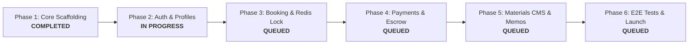

# Engineering Delivery Roadmap & Progress Tracking

## 1. 6-Phase Delivery Roadmap

| Phase | Milestone Description | Target Window | Status | Owner / Assignee |
| :--- | :--- | :--- | :--- | :--- |
| **Phase 1** | Monorepo scaffolding, Django 5.1 REST API + Next.js 14 setup, Postgres models, initial migrations & test suite | Sept 2026 | `COMPLETED` | Anesu MUPESA / Antigravity |
| **Phase 2** | JWT Authentication, User Roles (Student/Teacher/Admin), Profile Management, IANA Timezone Engine | Oct 2026 | `IN PROGRESS` | Anesu MUPESA / AI Agents |
| **Phase 3** | Redlock 10-Min Reservation Lock, Slot Availability Projection, Zoom S2S OAuth Meeting Generation, Google Calendar API | Oct 2026 | `QUEUED` | Anesu MUPESA / AI Agents |
| **Phase 4** | PayFast (ZAR) Webhooks, PayPal v2 Orders (USD), Multi-Currency Ledger, Monthly Batch Payout Engine | Oct 2026 | `QUEUED` | Anesu MUPESA / AI Agents |
| **Phase 5** | Materials CMS Catalog, Interactive Article Reader, Post-Lesson Memo Studio, Confidential Student Dossier | Nov 2026 | `QUEUED` | Anesu MUPESA / AI Agents |
| **Phase 6** | E2E Integration Tests, Zoom Attendance Webhook Auditing, Cloudflare R2 Recording Expiration Policy, Production Launch | Nov 2026 | `QUEUED` | Anesu MUPESA / AI Agents |

---

## 2. Component Implementation Progress Matrix

### 2.1 Backend Services (`Project-files/backend/`)
- [x] Django 5.1 & DRF Monorepo Structure
- [x] `apps.users`, `apps.teachers`, `apps.materials`, `apps.bookings`, `apps.payments`, `apps.crm`, `apps.reviews` schema models
- [x] PostgreSQL database migrations applied cleanly
- [x] `seed_data` script initialized (`admin`, `student_aiko`, 3 tutors, 4 materials)
- [x] `pytest` suite configured (`conftest.py` with eager Celery & `LocMemCache`)
- [x] Health check endpoint (`GET /api/health/`)
- [x] JWT Auth endpoints (`/api/v1/auth/token/`, `/api/v1/auth/register/`)
- [x] Redis Redlock reservation engine (`SET booking:slot:... NX EX 600`)
- [-] Zoom S2S OAuth Client & Webhook Receiver
- [-] PayFast ITN & PayPal Webhook Handlers
- [*] See comprehensive breakdown in [`docs/MASTER_MODULE_ROADMAP_AND_ARCHITECTURE.md`](./MASTER_MODULE_ROADMAP_AND_ARCHITECTURE.md)

### 2.2 Frontend Services (`Project-files/frontend/`)
- [x] Next.js 14 App Router (TypeScript, Tailwind CSS)
- [x] 12/12 Static and Dynamic Route build compilation (`npm run build` succeeds)
- [x] Public Marketing Landing Page (`/`)
- [x] Tutor Directory Listing (`/tutors`)
- [x] Tutor Public Profile (`/tutors/[slug]`)
- [x] Curriculum Catalog (`/materials`)
- [x] Student Command Dashboard (`/student/dashboard`)
- [x] Teacher Operations Dashboard (`/teacher/dashboard`)
- [x] Admin Operations Telemetry Dashboard (`/admin/dashboard`)
- [ ] API Axios / Fetch Client Integration with Backend JWT Auth
- [ ] Live Classroom Launch Pad & Zoom Embed Bridge
- [ ] PayFast & PayPal SDK Checkout Integration

---

## 3. Master 46-View Page Inventory Tracker

| View ID | Path / Route | View Name | Status |
| :--- | :--- | :--- | :--- |
| `PUB-01` | `/` | Global Marketing Homepage | `Built (Static)` |
| `PUB-02` | `/tutors` | Tutor Discovery & Search Engine | `Built (Static)` |
| `PUB-03` | `/tutors/[slug]` | Tutor Profile & Video Reel | `Built (Static)` |
| `PUB-04` | `/materials` | Interactive Curriculum Catalog | `Built (Static)` |
| `PUB-05` | `/materials/[slug]` | Material Content Reader | `Built (Static)` |
| `PUB-06` | `/pricing` | Geo-Localized Pricing & Plans | `Built (Static)` |
| `STU-01` | `/student/dashboard` | Student Command Dashboard | `Built (Static)` |
| `STU-02` | `/student/book/[tutorId]` | Booking Matrix | `Built (Static)` |
| `STU-03` | `/student/checkout/[id]` | Multi-Currency Checkout | `Built (Static)` |
| `STU-05` | `/student/classroom/[id]` | Live Classroom Pad | `Built (Static)` |
| `TEA-02` | `/teacher/dashboard` | Tutor Operations Dashboard | `Built (Static)` |
| `TEA-03` | `/teacher/schedule` | Availability & Calendar Sync | `Built (Static)` |
| `TEA-05` | `/teacher/bookings/[id]/memo` | Post-Lesson Memo Studio | `Built (Static)` |
| `TEA-09` | `/teacher/power-guard` | Eskom Outage Manager | `Built (Static)` |
| `ADM-01` | `/admin/dashboard` | Global Operations Dashboard | `Built (Static)` |
| `ADM-05` | `/admin/finance/ledger` | Multi-Currency Escrow Audit | `Built (Static)` |
| `ADM-06` | `/admin/finance/payouts` | Batch Payout Orchestrator | `Built (Static)` |

---

## 4. Current Active Sprint Backlog (Sprint 2)

- [ ] **Task 2.1**: Implement JWT Authentication Endpoints (`/api/v1/auth/token/login/`, `/token/refresh/`) in Django `apps/users`.
- [ ] **Task 2.2**: Wire Next.js Auth Context & Token Storage for Student/Teacher login.
- [ ] **Task 2.3**: Implement Redis Lock Helper (`Redlock` 10-min reservation TTL) in `apps/bookings/services.py`.
- [ ] **Task 2.4**: Create Zoom S2S OAuth API client wrapper (`apps/bookings/zoom_client.py`).
- [ ] **Task 2.5**: Document all new endpoint schemas in [`docs/ARCHITECTURE_AND_SCHEMA.md`](./ARCHITECTURE_AND_SCHEMA.md).
