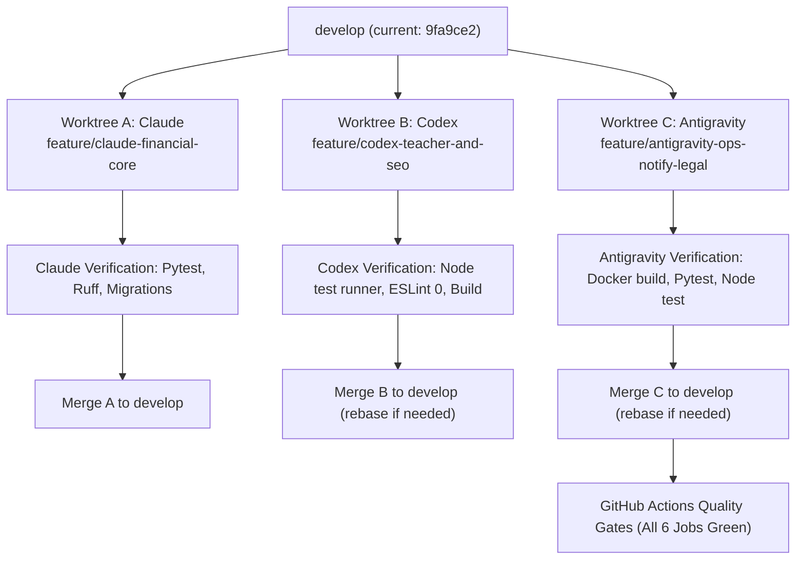

# Tri-Agent Parallel Execution Plan (Phases 10–15)

**Created:** 2026-10-06  
**Parent Plans:** [`docs/PRODUCTION_READINESS_PLAN.md`](PRODUCTION_READINESS_PLAN.md), [`docs/PHASE_11_12_EXECUTION_PLAN.md`](PHASE_11_12_EXECUTION_PLAN.md)  
**Coordination Rules:** [`docs/AI_AGENT_COLLABORATION_RULES.md`](AI_AGENT_COLLABORATION_RULES.md)  
**Target Branch:** `develop` (Clean, CI Passing at `9fa9ce2`)

---

## 0. Collaboration & Isolation Protocol

Per `AI_AGENT_COLLABORATION_RULES.md`:
1. **Branch & Worktree Isolation**:
   - Claude works in git worktree `.claude/worktrees/claude-financial-core` on branch `feature/claude-financial-core`.
   - Codex works in git worktree `.claude/worktrees/codex-teacher-and-seo` on branch `feature/codex-teacher-and-seo`.
   - Antigravity works in git worktree `.claude/worktrees/antigravity-ops-notify-legal` on branch `feature/antigravity-ops-notify-legal`.
2. **Quality Gates Before Merge**:
   - Backend: `python manage.py check`, `python manage.py makemigrations --check`, `ruff check .`, `pytest` green.
   - Frontend: `npm test` (Node test runner 203+ tests), `npm run lint` (0 warnings), `npm run check:api-types`, `npm run build` (Next.js 16 clean).
   - Zero symptom patching, shrink-only guard allowlists.
3. **Subagent Delegation**:
   - Agents are explicitly permitted and encouraged to spin up subagents (e.g. `research` for API contract discovery, `self` for test writing) to execute sub-slices cleanly.

---

## 1. Work Package Allocations

| Package | Agent | Core Focus | Key Deliverables |
| :--- | :--- | :--- | :--- |
| **Package A** | **Claude** | Backend Financial Core & Integrations | **Task 10.8** (Receipts & Invoices), **Slices P1a–P1c** (Payout Batches & Anti-Double-Pay), **Slice G2** (Google Calendar Free/Busy Hints), **Slice T3b** (Admin Materials Asset Commit) |
| **Package B** | **Codex** | Teacher Portal, Training LMS & SEO | **Task 11.5 / T6** (Teacher Training Center UI), **Task 11.11 / T7a–c** (Live Teacher Portal Wiring), **Phase 15** (Student Schedule/Favorites & Next.js SEO) |
| **Package C** | **Antigravity** | Notifications, Platform Ops & Compliance | **Slices N2a–c, N4, N3** (Domain Notifications & Svix Webhook), **Tasks 13.1–13.2** (Production Dockerfiles & Lockfiles), **Phase 14** (Legal Hub, Cookie Banner & SAR Export) |

---

## 2. Package A: Claude (Backend Financial Core & Integrations)

### Tasks & Technical Specifications

#### 1. Task 10.8 — Invoices & Receipts Engine
- **Backend Model (`apps/payments/models.py`)**:
  - `Receipt(id UUID, transaction FK, student FK, receipt_number VARCHAR UNIQUE, currency, subtotal, tax_amount, total_amount, pdf_storage_key, created_at)`.
  - Sequential receipt number generator: `INV-YYYYMM-XXXXX`.
- **PDF Generation (`apps/payments/services/receipts.py`)**:
  - Render branded PDF via `reportlab` or HTML-to-PDF with student name, lesson/pack details, platform VAT placeholder, and payment timestamp.
  - Upload to Cloudflare R2 private bucket or generate on-the-fly.
- **REST Endpoints (`apps/payments/views.py`)**:
  - `GET /api/v1/payments/receipts/`: List authenticated student's receipts.
  - `GET /api/v1/payments/receipts/<id>/pdf/`: Stream receipt PDF (scoped to owner).
- **Tests**:
  - `tests/test_receipts.py`: Test receipt creation on payment capture, sequential number uniqueness, owner isolation (IDOR protection).

#### 2. Slices P1a–P1c — Real Payout Batch Architecture
- **Backend Models (`apps/admin_api/models.py` & `apps/payments/models.py`)**:
  - Extend `PayoutBatch`: `status in (pending, approved, exported, processed, cancelled)`.
  - `PayoutBatchLine(id, batch FK, teacher FK, amount_zar Decimal, status pending|approved|exported|paid|returned, is_open Boolean)`.
  - Partial Unique Constraint: `UniqueConstraint(fields=['teacher'], condition=Q(is_open=True))` to prevent double-spending a tutor's balance across concurrent batches.
  - `PayoutAttempt(id, line FK, initiated_by FK, status, error_message, created_at)`.
- **Maker-Checker Enforcement**:
  - `approve` and `process` actions reject if the executing staff user is the batch creator (`maker_checker_violation`).
- **ACB / EFT Export**:
  - Export CSV formatted for South African clearing banks (Capitec, FNB, Standard Bank, Nedbank, Absa) with universal branch codes.
  - Formula injection defense: sanitize fields starting with `=`, `+`, `-`, `@`.
- **Double-Entry Ledger Settlement**:
  - On `mark_processed`: emit atomic `LedgerEntry` debiting 2020 (Tutor Escrow Clearing) and crediting 1030 (Operating Bank Account).
- **Tests**:
  - `tests/test_payout_batches.py`: Test line isolation, anti-double-pay constraint, maker-checker rejection, and formula injection sanitization.

#### 3. Slice G2 — Google Calendar Free/Busy Hint Integration
- **Service Extension (`apps/integrations/google_calendar.py`)**:
  - Query Google Calendar `freeBusy.query` for active tutors who have `CalendarCredential` connected and `block_busy=True`.
  - Exclude Sharon Online's own lesson bookings (identified via private extended properties) so they are not double-counted as external busy slots.
  - Fail open: if Google Calendar API errors or throttles, fallback to normal availability without failing the endpoint.
- **Slot Generator (`apps/bookings/services/slot_generator.py`)**:
  - Add `include_external_busy: bool = False`. Only the public listing query enables this; checkout and reserve enforce strict DB records only.
- **Tests**:
  - `tests/test_gcal_freebusy.py`: Test busy interval subtraction, Sharon lesson exclusion, and fail-open resilience.

#### 4. Slice T3b — Admin Materials Asset Commit
- **Endpoint (`apps/materials/views.py`)**:
  - `POST /api/v1/materials/<id>/assets/commit/`: Admin endpoint to attach PDF lesson sheets and audio clips to curriculum materials.
  - Enforce quarantine validation: check ETag, verify magic bytes (PDF `%PDF-`, audio `ID3`/`OggS`/`RIFF`), and copy to permanent materials storage.
- **Tests**:
  - `tests/test_materials_asset_commit.py`: Verify ETag mismatch rejection, corrupted magic byte rejection, and successful commit.

### Definition of Done for Claude
- All migrations reversible (`python manage.py makemigrations --check`).
- Pytest suite passes 100% with no new warnings.
- `ruff check .` passes with 0 violations and shrinks `ruff.toml` baseline if applicable.
- Branch `feature/claude-financial-core` cleanly mergeable into `develop`.

---

## 3. Package B: Codex (Teacher Portal, Training LMS & SEO)

### Tasks & Technical Specifications

#### 1. Task 11.5 / T6 — Teacher Training Center Frontend LMS
- **Routes & Pages**:
  - `/teacher/training`: Dashboard listing all 5 training modules, module status (completed vs pending), and progress bar.
  - `/teacher/training/[slug]`: High-readability reading view rendering module Markdown body, video embed player, key takeaways checklist, and "Complete & Continue" button.
- **API Integration**:
  - `GET /api/v1/teachers/me/training/`: Fetch module list and progress.
  - `GET /api/v1/teachers/me/training/[slug]/`: Fetch module details.
  - `POST /api/v1/teachers/me/training/[slug]/complete/`: Submit completion.
- **Client & Navigation**:
  - Gate indicator: if `training_completed_at` is null, show a clear banner explaining that calendar slots remain locked until all modules are completed.

#### 2. Task 11.11 / T7a–c — Teacher Portal Real API Wiring
- **`/teacher/profile`**:
  - Wire to live `GET /api/v1/teachers/me/` and `PATCH /api/v1/teachers/me/`.
  - Allow editing `headline`, `bio`, and `specialties` (multi-select pill selector).
  - Display read-only badge for `tutor_status` (applied, in_review, approved, changes_requested, suspended).
  - Remove all mock user fallbacks.
- **`/teacher/schedule`**:
  - Wire to live `GET /api/v1/teachers/availability/` and `PUT /api/v1/teachers/availability/replace/`.
  - 7-day recurring grid in SAST (UTC+2) with discrete 25-minute slots.
  - Time-off modal calling `POST /api/v1/teachers/time-off/`.
  - Handle 409 conflict errors displaying conflicting bookings.
- **`/teacher/dashboard`**:
  - Wire upcoming class hero to `GET /api/v1/bookings/?status=confirmed&ordering=start_time`.
  - Wire pending memos counter to `GET /api/v1/bookings/?status=completed&has_memo=false`.
  - Live Eskom banner driven by `GET /api/v1/integrations/eskom/status/`.

#### 3. Phase 15 — Student Schedule/Favorites & Next.js SEO
- **`/student/schedule`**:
  - Interactive calendar view of upcoming and past booked lessons in student's timezone.
  - Quick action buttons: "Enter Classroom" (within 15m window) and "Add to Google Calendar".
- **`/student/favorites`**:
  - Bookmarked tutors list with live next available slot preview.
- **SEO & Metadata**:
  - Implement `generateMetadata` across all public routes (`/`, `/tutors`, `/tutors/[id]`, `/materials`, `/pricing`, `/how-it-works`, `/teach`).
  - Add OpenGraph image cards and canonical URLs.
  - Create dynamic `frontend/src/app/sitemap.ts` and `robots.ts` (disallowing `/student/*`, `/teacher/*`, `/admin/*`).
  - Add JSON-LD EducationalOrganization and Course schemas.

### Definition of Done for Codex
- `npm test` runs all unit tests and new component tests cleanly (215+ tests).
- `npm run lint` passes with 0 warnings (`--max-warnings 0`).
- `npm run check:api-types` passes with zero contract drift.
- `npm run build` passes with Next.js Turbopack compiler.
- Branch `feature/codex-teacher-and-seo` cleanly mergeable into `develop`.

---

## 4. Package C: Antigravity (Notifications, Platform Ops & Compliance)

### Tasks & Technical Specifications

#### 1. Slices N2a–c, N4, N3 — Domain Notifications & Svix Webhook
- **Domain Event Triggers (`apps/notifications/tasks.py`)**:
  - Wire Celery tasks to call `notify()` for key events:
    - **Reminders (N2a)**: T-24h and T-1h lesson notifications to student and tutor; T-10m classroom open ping; 12h post-lesson memo reminder.
    - **Booking Lifecycle (N2b)**: Instant booking confirmed, student cancellation (with refund amount if applicable), tutor cancellation alert, reschedule confirmation. Use generation keys `{bid}:{reschedule_count}`.
    - **Tutor Governance (N2c)**: Application submitted alert, vetting outcome (approved or changes requested with reasons), strike issued, suspension warning.
    - **Eskom Shield (N4)**: Outage overlap notification wrapping existing Eskom task with deterministic outbox keys.
- **Svix Webhook Receiver (N3)**:
  - `POST /api/v1/notifications/webhooks/resend/`: Handle `email.bounced` and `email.complained`.
  - Update `Notification.email_state = 'bounced'` and disable email delivery in `NotificationPreference`.
- **Frontend Receipt Drawer Integration**:
  - In `/student/wallet`, mount a slide-out receipt inspector fetching from `GET /api/v1/payments/receipts/` with download triggers.

#### 2. Tasks 13.1 & 13.2 — Production Dockerfiles & Dependency Lockfiles
- **Backend Dockerfile (`backend/Dockerfile`)**:
  - Multi-stage build (builder stage for wheels, runner stage on `python:3.12-slim`).
  - Non-root user `appuser`, `collectstatic` execution, healthcheck on `/api/health/`.
  - Gunicorn configuration (`gunicorn config.wsgi:application --bind 0.0.0.0:8000 --workers 4 --threads 2`).
- **Frontend Dockerfile (`frontend/Dockerfile`)**:
  - Multi-stage build utilizing Next.js `output: 'standalone'`.
  - Non-root user `nextjs`, optimized asset copy from `.next/standalone` and `.next/static`.
- **Dependency Hygiene**:
  - Generate strict dependency lockfile using `uv pip compile` or `pip-tools` from `requirements.in`.

#### 3. Phase 14 — Legal Hub, Cookie Consent & SAR Pipeline
- **Legal Pages (`frontend/src/app/(public)/legal/[policy]/page.tsx`)**:
  - Dynamic route rendering Markdown legal documents: `terms`, `privacy`, `refunds`, `child-safety`, `cookies`.
  - Clean typography, table of contents, last updated date, and printable styling.
- **Accessible Cookie Banner (`frontend/src/components/legal/CookieBanner.tsx`)**:
  - WCAG-compliant cookie consent bar with "Accept All", "Reject Non-Essential", and "Customize" (analytics, marketing).
  - Persist selection in localStorage with consent versioning.
- **SAR Data Export Pipeline (`apps/users/services/data_export.py`)**:
  - `GET /api/v1/auth/me/data-export/`: Generate JSON zip archive of user's profile, lesson history, memos, and preferences.
  - Redact internal financial liability records and exclude third-party staff internal notes.

### Definition of Done for Antigravity
- Backend and frontend tests pass 100%.
- ESLint and Ruff pass with 0 warnings.
- Docker builds succeed and pass container vulnerability scans.
- Branch `feature/antigravity-ops-notify-legal` cleanly mergeable into `develop`.

---

## 5. Verification & Merging Roadmap

1. **Step 1:** Dispatch prompts to Claude, Codex, and Antigravity.
2. **Step 2:** Each agent works strictly within their assigned worktree.
3. **Step 3:** Merge Package A (Claude) -> Verify CI.
4. **Step 4:** Rebase & Merge Package B (Codex) -> Verify CI.
5. **Step 5:** Rebase & Merge Package C (Antigravity) -> Verify CI.
6. **Step 6:** All 10 unblocked priorities marked complete in `docs/PROGRESS_AND_ROADMAP.md`.
