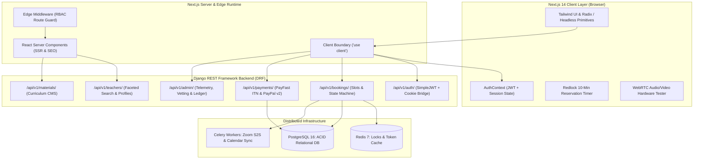
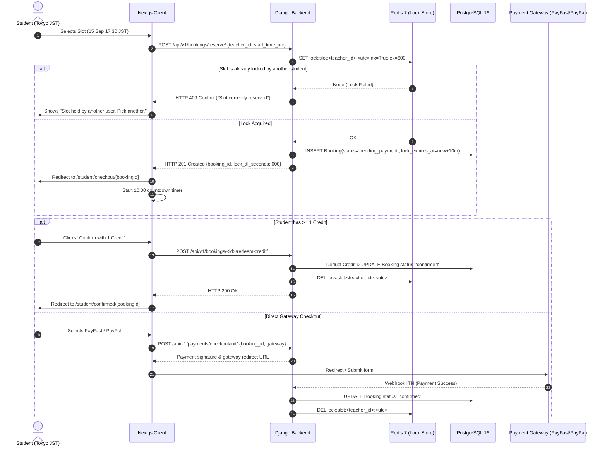
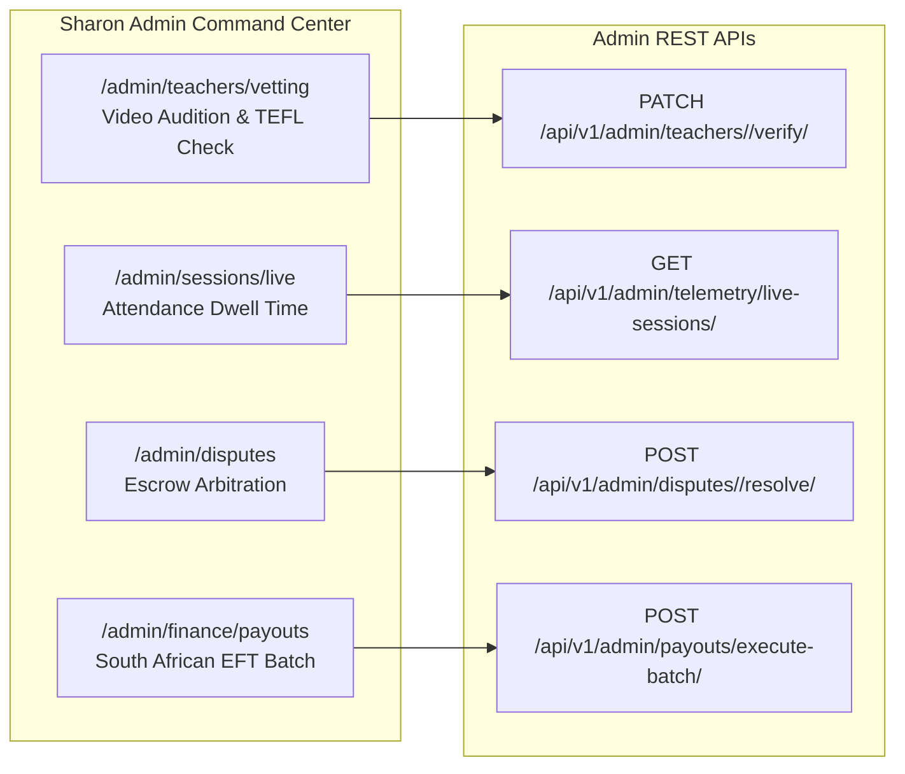

# Vertical Slicing UI Migration Plan & Technical Execution Guide
## Sharon's ESL Marketplace Platform (Figma React Export -> Next.js 14 App Router)

**Document Version:** 1.0 (Production Master Specification)  
**Author:** Principal Systems Architect & Lead Enterprise Solutions Designer  
**Source Codebase:** `C:\Dev\Active Projects\Sharon Online\sharon-online-figma-v26`  
**Target Codebase:** `C:\Dev\Active Projects\Sharon Online\Project-files\frontend`  
**Backend API:** `C:\Dev\Active Projects\Sharon Online\Project-files\backend` (Django REST Framework + SimpleJWT + Redis + Celery + PostgreSQL)  
**Target Output Path:** `Project-files/docs/UI_VERTICAL_SLICE_MIGRATION_PLAN.md`

---

## Executive Architectural Strategy

### The Vertical Slice Paradigm
In traditional monolithic migrations, teams migrate horizontal layers across all screens (e.g. all mock views first, or all API clients first), resulting in unverified "zombie code", phantom type dependencies, and cascading breakage when integrating real APIs. 

In Sharon's ESL platform migration, we enforce **strict vertical slicing**:
1. **Self-Contained Slices**: Each slice delivers a complete, end-to-end user-facing capability comprising UI components, state management, Next.js App Router route handlers, typed API client methods, and automated acceptance tests.
2. **Immediate API Contract Binding**: No screen is left with dummy hardcoded arrays or prototype stubs. Mock data (`sharon-online-figma-v26/src/data.ts`) is converted into DRF fixture seeds or fallback development fixtures while production types directly reflect Django REST Framework serializer payloads.
3. **Zero Dead Code & Clean Separation**: The Figma export bundles styling and monolithic switch-case routers (`App.tsx`). Each slice extracts pure, atomic components into `@/components/ui/` or dedicated feature modules (`@/components/<feature>/`), isolating Server Components from Client Components with strict boundary markers (`'use client'`).
4. **Timezone & Currency Integrity**: South African tutors operate in SAST (UTC+2) with ZAR payouts; students operate across JST (UTC+9), KST (UTC+9), or CET/CEST (UTC+1/+2) paying in USD/EUR/JPY. Every vertical slice enforces strict UTC normalization at the network boundary and timezone-aware localized rendering in the presentation layer.

---

## System Architecture & Client-Server Boundary Topology



---

## Slice 0: Design System Tokens, Typography & Shared Primitives

### 1. Scope & Architectural Intent
The Figma React export (`sharon-online-figma-v26`) defines an editorial, warm aesthetic specifically designed for an educational marketplace:
- **Typography**: Dual font hierarchy using `'Lora'` (warm serif for editorial headings) and `'DM Sans'` (modern grotesque sans for data tables, metrics, and navigation).
- **Color Palette**: Sophisticated terracotta rust (`#A94332`), rich plum/teal portal backgrounds (`#4A2948` / `#0D4440`), warm cream foundations (`#FFF8F2`, `#F4E7DA`), golden accents (`#E7A83E`, `#D4A84B`), and soft ink typography (`#2D2521`, `#6B5B53`).
- **Elevations**: Subtle tinted drop shadows (`rgba(45, 37, 33, 0.07)`).

Slice 0 migrates these tokens from Figma's `index.css` and `components.tsx` into Next.js Tailwind configuration and creates headless, accessible, and reusable primitives in `src/components/ui/`.

### 2. Source Figma Artifacts
- Files: `sharon-online-figma-v26/src/index.css`, `sharon-online-figma-v26/src/components.tsx`
- Key Components: `Btn`, `Badge`, `Avatar`, `Stars`, `Input`, `StatCard`, `EyebrowLabel`, `PageHeader`, `ChecklistItem`, `SimulationNotice`, `Divider`, `RoleChip`.

### 3. Target Next.js File Topology
```text
frontend/
├── src/
│   ├── app/
│   │   ├── globals.css                # Font imports, CSS custom properties, utility classes
│   │   └── layout.tsx                 # Root layout with DM Sans & Lora Google font configuration
│   ├── components/
│   │   └── ui/
│   │       ├── Button.tsx             # Polymorphic button (primary, secondary, quiet, destructive, gold)
│   │       ├── Badge.tsx              # Multi-state status pill with animated or static color dots
│   │       ├── Avatar.tsx             # Optimized image avatar with fallback initials & color hashing
│   │       ├── StarRating.tsx         # SVG fractional rating display & interactive rubric picker
│   │       ├── Input.tsx              # Form input with floating label, validation errors, and hints
│   │       ├── Card.tsx               # Base card, StatCard, and StoryCard wrappers with tinted shadows
│   │       ├── Modal.tsx              # Accessible dialog overlay with backdrop blur & keyboard focus trap
│   │       ├── Tabs.tsx               # Horizontal tab list for filter facets and role dashboards
│   │       └── Tooltip.tsx            # Floating micro-tooltips for CEFR definitions and Eskom stages
│   └── lib/
│       └── utils.ts                   # cn() class merging utility (clsx + tailwind-merge)
```

### 4. Implementation Recipe for Coding Agents

#### Step 0.1: Tailwind Theme & Token Configuration
Update `tailwind.config.ts` to expose the Figma tokens:
```typescript
// frontend/tailwind.config.ts
import type { Config } from "tailwindcss";

const config: Config = {
  content: ["./src/**/*.{js,ts,jsx,tsx,mdx}"],
  theme: {
    extend: {
      colors: {
        cream: {
          DEFAULT: "#FFF8F2",
          deep: "#F4E7DA",
          surface: "#FFF4EA",
        },
        ink: {
          DEFAULT: "#2D2521",
          muted: "#6B5B53",
          faint: "#8A746A",
        },
        primary: {
          DEFAULT: "#A94332",
          hover: "#873426",
          surface: "#FFF4EA",
        },
        accent: {
          DEFAULT: "#E7A83E",
          surface: "#F7EBD0",
        },
        gold: {
          DEFAULT: "#B07D2E",
          bright: "#D4A84B",
          surface: "#FAF0DC",
        },
        success: {
          DEFAULT: "#52705A",
          surface: "#EEF3EC",
        },
        plum: {
          DEFAULT: "#4A2948",
          dark: "#3B1F39",
          surface: "#FFF1E6",
        },
        teal: {
          DEFAULT: "#0D4440",
          hover: "#092E2B",
          mid: "#1A6B66",
        },
        divider: "#E4D3C6",
      },
      fontFamily: {
        sans: ["var(--font-sans)", "DM Sans", "system-ui", "sans-serif"],
        serif: ["var(--font-serif)", "Lora", "Georgia", "serif"],
      },
      boxShadow: {
        card: "0 1px 3px rgba(45, 37, 33, 0.07), 0 8px 24px rgba(45, 37, 33, 0.05)",
        "card-hover": "0 2px 6px rgba(45, 37, 33, 0.08), 0 16px 34px rgba(45, 37, 33, 0.08)",
        "card-sm": "0 1px 4px rgba(45, 37, 33, 0.07)",
      },
    },
  },
  plugins: [],
};
export default config;
```

#### Step 0.2: Font Optimization in Root Layout
In `src/app/layout.tsx`, import `DM_Sans` and `Lora` from `next/font/google`:
```typescript
import { DM_Sans, Lora } from 'next/font/google';

const dmSans = DM_Sans({
  subsets: ['latin'],
  variable: '--font-sans',
  display: 'swap',
});

const lora = Lora({
  subsets: ['latin'],
  variable: '--font-serif',
  display: 'swap',
});
```

#### Step 0.3: Port UI Primitives with TypeScript Strictness
- Convert `Btn` into `src/components/ui/Button.tsx` with forwardRef, disabled state indicators, loading spinner integration, and variant styles: `primary`, `secondary`, `quiet`, `destructive`, `gold`.
- Convert `Badge` into `src/components/ui/Badge.tsx` supporting statuses: `confirmed`, `pending`, `cancelled`, `processing`, `cleared`, `onboarding`, `approved`, `error`, `disputed`.
- Build `src/components/ui/Avatar.tsx` with Next.js `<Image />` component, handling Cloudflare R2 / Unsplash domains with remote pattern security.

### 5. Verification & Acceptance Criteria
1. `npm run build` compiles with 0 TypeScript or Tailwind errors.
2. Storybook or standalone test page renders all button states (hover, active, disabled, loading) with correct color hex codes.
3. Contrast ratio of `#A94332` on `#FFF8F2` exceeds WCAG AA standard (4.5:1) for body and button text.

---

## Slice 1: Public Marketing & Discovery Suite

### 1. Scope & Architectural Intent
The public presentation layer serves prospective students in East Asia and Europe as well as South African tutor applicants. It must load under 800ms, rank high in SEO, and clearly articulate the 25-minute lesson proposition, pricing transparency, and native South African accent advantages.

### 2. Source Figma Artifacts
- Components: `src_screens_HomeScreen.tsx`, `PublicScreens.tsx` (`StartScreen`, `PricingScreen`, `TeachScreen`, `SupportScreen`, `OnboardScreen`)
- Mock Data: `GOALS`, `MATERIALS`, `TUTORS` preview slice from `src/data.ts`.

### 3. Target Next.js File Topology
```text
frontend/src/app/
├── (public)/
│   ├── page.tsx                       # High-converting Landing Page (SSR)
│   ├── pricing/
│   │   └── page.tsx                   # Multi-Currency Pricing Calculator & Credit Bundles
│   ├── how-it-works/
│   │   └── page.tsx                   # Interactive 4-step walkthrough (Slot -> Zoom -> Memo -> Fluency)
│   ├── trust-safety/
│   │   └── page.tsx                   # Eskom Power Guard, Vetted South African Native Tutors & Escrow
│   ├── teach/
│   │   └── page.tsx                   # Tutor recruitment & earnings breakdown ($6.40 / 25 min net)
│   └── support/
│       └── page.tsx                   # Inquiry ticket submission & live FAQ accordion
├── components/
│   ├── public/
│   │   ├── HeroSection.tsx            # Headline, video teaser, and 1-click goal picker
│   │   ├── GoalSelector.tsx           # Work, Interview, Conversation, Presentation, Travel tabs
│   │   ├── HowItWorksSteps.tsx        # Responsive step cards with animated SVG connectors
│   │   ├── CurrencySwitcher.tsx       # Geolocation currency selector (USD, ZAR, EUR, JPY)
│   │   ├── PricingTable.tsx           # 1, 5, 10, 20 Lesson Bundles with per-lesson discount tags
│   │   └── PowerGuardCallout.tsx      # Eskom load shedding resilience showcase
│   ├── Navbar.tsx                     # Responsive sticky nav with mobile drawer & role shortcuts
│   └── Footer.tsx                     # Multi-column semantic footer with legal and compliance links
```

### 4. Client / Server Boundary Breakdown
- `src/app/(public)/page.tsx`: **Server Component** (SSR for SEO, metadata, fast initial paint).
- `src/components/public/GoalSelector.tsx`: **Client Component (`'use client'`)** for active goal state toggling and preview card filtering.
- `src/components/public/CurrencySwitcher.tsx`: **Client Component (`'use client'`)** managing active currency in LocalStorage.
- `src/app/(public)/pricing/page.tsx`: **Server Component** fetching standard credit packages, wrapping client pricing selector.

### 5. Backend Django REST API Integration
- `GET /api/v1/teachers/?is_featured=true&limit=3`: Retrieves vetted featured tutors for the home page.
- `GET /api/v1/payments/credits/bundles/`: Retrieves active credit bundle rates across currencies:
  ```json
  [
    { "id": "bundle_1", "credits": 1, "price_usd": 8.00, "price_zar": 150.00, "price_jpy": 1200 },
    { "id": "bundle_5", "credits": 5, "price_usd": 38.00, "price_zar": 700.00, "price_jpy": 5700 },
    { "id": "bundle_10", "credits": 10, "price_usd": 72.00, "price_zar": 1300.00, "price_jpy": 10800 },
    { "id": "bundle_20", "credits": 20, "price_usd": 136.00, "price_zar": 2400.00, "price_jpy": 20400 }
  ]
  ```
- `POST /api/v1/auth/inquiries/`: Support inquiry dispatch.

### 6. Implementation Recipe
1. Port `HomeScreen` from `src_screens_HomeScreen.tsx` into modular sections in `src/components/public/`.
2. Replace static `onNavigate('P-TUTORS')` calls with Next.js `<Link href="/tutors">`.
3. Wire `CurrencySwitcher` to auto-detect browser locale (`Intl.DateTimeFormat().resolvedOptions().timeZone` or Cloudflare `CF-IPCountry` header) and default to `JPY` for Asia, `EUR` for Europe, `ZAR` for South Africa, `USD` otherwise.
4. Implement FAQ accordion with accessible HTML `<details>` and `<summary>` or Radix Accordion.

### 7. Verification & Acceptance Criteria
1. Lighthouse Performance score >= 90; First Contentful Paint < 1.0s.
2. Clicking currency buttons re-renders credit pack prices without page reload.
3. Mobile hamburger navigation opens smoothly without horizontal viewport scrolling.

---

## Slice 2: Authentication & Multi-Role Session Provider

### 1. Scope & Architectural Intent
The platform operates 3 distinct user roles:
- **`student`**: Books lessons, views memos, manages credits, and launches Zoom classroom.
- **`teacher`**: Sets availability, manages Eskom power guard, submits memos, and views earnings.
- **`admin`**: Sharon & operations team vetting tutors, monitoring live sessions, arbitrating disputes, and executing payouts.

Slice 2 delivers JWT token persistence, silent refresh, role-based session hydration, and Edge Route Protection Middleware to strictly isolate user workspaces.

### 2. Source Figma Artifacts
- Components: `PublicScreens.tsx` (`LoginScreen`, `SignupScreen`, `VerifyScreen`, `P-RESET`)
- Prototype role switchers: Prototype dropdown menu in `App.tsx` (lines 224-236).

### 3. Target Next.js File Topology
```text
frontend/src/
├── app/
│   ├── (auth)/
│   │   ├── login/
│   │   │   └── page.tsx               # Multi-role login with email/password & role redirect
│   │   ├── register/
│   │   │   └── page.tsx               # Student / Teacher role selection tab & registration
│   │   ├── forgot-password/
│   │   │   └── page.tsx               # Password reset link dispatch
│   │   └── reset-password/
│   │       └── page.tsx               # Token verification & new password submission
├── context/
│   └── AuthContext.tsx                # Context provider exposing user, token, role, login(), logout()
├── middleware.ts                      # Next.js Edge Middleware for RBAC route guards
└── lib/
    ├── auth.ts                        # Token storage helpers (HttpOnly cookie sync & localStorage fallback)
    └── api.ts                         # Axios/Fetch interceptor injecting 'Authorization: Bearer <token>'
```

### 4. TypeScript Interfaces & Data Contracts
```typescript
// src/types/auth.ts
export type UserRole = 'student' | 'teacher' | 'admin';

export interface AuthUser {
  id: string;
  email: string;
  first_name: string;
  last_name: string;
  role: UserRole;
  country: string;
  timezone: string;
  avatar_url?: string;
  credits?: number; // Present if role === 'student'
  is_verified?: boolean; // Present if role === 'teacher'
}

export interface AuthTokens {
  access: string;
  refresh: string;
}

export interface LoginResponse {
  tokens: AuthTokens;
  user: AuthUser;
}
```

### 5. Backend Django REST API Mappings
| Route | Method | DRF View | Description |
| :--- | :--- | :--- | :--- |
| `/api/v1/auth/token/` | POST | `CustomTokenObtainPairView` | Exchanges email/password for JWT with embedded claims |
| `/api/v1/auth/token/refresh/` | POST | `TokenRefreshView` | Silent token renewal before 15-minute access expiry |
| `/api/v1/auth/register/` | POST | `RegisterView` | Creates User + TeacherProfile if role=='teacher' |
| `/api/v1/auth/me/` | GET | `CurrentUserView` | Returns authenticated user profile & balance |

### 6. Edge Route Protection Middleware Specification
Create `src/middleware.ts` running on Next.js Edge Runtime:
```typescript
import { NextResponse } from 'next/server';
import type { NextRequest } from 'next/request';

export function middleware(request: NextRequest) {
  const token = request.cookies.get('sharon_access_token')?.value;
  const role = request.cookies.get('sharon_user_role')?.value;
  const { pathname } = request.nextUrl;

  const isStudentRoute = pathname.startsWith('/student');
  const isTeacherRoute = pathname.startsWith('/teacher');
  const isAdminRoute = pathname.startsWith('/admin');

  if (isStudentRoute || isTeacherRoute || isAdminRoute) {
    if (!token) {
      const loginUrl = new URL('/login', request.url);
      loginUrl.searchParams.set('next', pathname);
      return NextResponse.redirect(loginUrl);
    }

    if (isStudentRoute && role !== 'student') {
      return NextResponse.redirect(new URL(role === 'teacher' ? '/teacher/dashboard' : '/admin/dashboard', request.url));
    }
    if (isTeacherRoute && role !== 'teacher') {
      return NextResponse.redirect(new URL(role === 'student' ? '/student/dashboard' : '/admin/dashboard', request.url));
    }
    if (isAdminRoute && role !== 'admin') {
      return NextResponse.redirect(new URL('/login', request.url));
    }
  }

  return NextResponse.next();
}

export const config = {
  matcher: ['/student/:path*', '/teacher/:path*', '/admin/:path*'],
};
```

### 7. Step-by-Step Implementation Recipe
1. Implement `AuthContext.tsx` providing `user`, `role`, `isAuthenticated`, `isLoading`, `login(credentials)`, `logout()`, `refreshUser()`.
2. Implement cookie bridge in `src/lib/auth.ts`: Upon receiving JWT from `/api/v1/auth/token/`, write `sharon_access_token` and `sharon_user_role` into cookies with `SameSite=Lax; Path=/; Secure`.
3. Port `LoginScreen` and `SignupScreen` from `PublicScreens.tsx` with full form validation (email format, minimum 8 characters password).
4. Implement automatic redirect: Upon login, `student` routes to `/student/dashboard`, `teacher` routes to `/teacher/dashboard`, and `admin` routes to `/admin/dashboard`.

### 8. Verification & Acceptance Criteria
1. Attempting to enter `/admin/dashboard` in an unauthenticated incognito tab redirects instantly to `/login?next=%2Fadmin%2Fdashboard`.
2. Logging in as a tutor redirects directly to `/teacher/dashboard`.
3. Inspecting network headers confirms `Authorization: Bearer <jwt>` is attached to all secured API calls.

---

## Slice 3: Tutor Directory, Faceted Filtering & Public Profile

### 1. Scope & Architectural Intent
The tutor catalog is the primary discovery engine. It must display vetted tutors, native South African and international accents, CEFR specialties, 60-second video auditions, and live upcoming slot previews with instant search feedback.

### 2. Source Figma Artifacts
- Components: `PublicScreens.tsx` (`TutorsScreen`, `ProfileScreen`), `components.tsx` (`TutorCard`, `Avatar`, `Stars`, `Badge`)
- Mock Data: `TUTORS` array in `data.ts`.

### 3. Target Next.js File Topology
```text
frontend/src/
├── app/(public)/
│   ├── tutors/
│   │   ├── page.tsx                   # Filterable Directory (SSR with Suspense)
│   │   └── [id]/
│   │       └── page.tsx               # Public Tutor Showcase & Schedule Matrix (SSR)
├── components/tutors/
│   ├── TutorFilters.tsx               # Faceted sidebar (Accent, Goal, Level, Max Price, Today's Availability)
│   ├── TutorGrid.tsx                  # Responsive 3-column card grid with loading skeleton
│   ├── TutorCard.tsx                  # Magazine layout card with photo gradient & next slot badge
│   ├── VideoReelPlayer.tsx            # Cloudflare Stream / HLS video player with 60s audition reel
│   ├── AudioSnippetButton.tsx         # 15s instant accent audition audio player
│   ├── TutorReviewList.tsx            # Aggregated student testimonials and star distribution
│   └── InlineSlotMatrix.tsx           # Embedded 7-day schedule grid with 1-click booking triggers
```

### 4. TypeScript Interfaces & Data Contracts
```typescript
// src/types/tutor.ts
export interface PublicTutor {
  id: string;
  user_id: string;
  full_name: string;
  first_name: string;
  tagline: string;
  bio: string;
  accent: 'South African' | 'British' | 'American' | 'Other';
  accent_display: string;
  country: string;
  country_flag: string;
  timezone: string;
  avatar_url?: string;
  intro_video_url?: string;
  intro_audio_url?: string;
  rating_avg: number;
  rating_count: number;
  review_percentage: number;
  lessons_completed: number;
  price_per_25min_usd: number;
  specialties: string[];
  learning_goals: Array<'business' | 'interview' | 'conversation' | 'presentation' | 'travel'>;
  learner_levels: string;
  has_inverter_backup: boolean;
  next_available_slot?: {
    start_time_utc: string;
    local_display: string; // e.g. "Tue 15 Sep · 17:30 JST"
  };
}
```

### 5. Backend Django REST API Mappings
- `GET /api/v1/teachers/`:
  - Query params: `?accent=South+African&specialty=Business&max_price=10&goal=interview&available_today=true&search=naledi`
  - Backend filtering powered by `django-filter` on verified active tutors (`is_verified=True, is_active=True`).
- `GET /api/v1/teachers/<id>/`:
  - Retrieves full tutor profile, certifications, and review aggregates.
- `GET /api/v1/bookings/slots/<teacher_id>/?tz=Asia%2FTokyo&days=7`:
  - Returns projected 25-minute discrete slots adjusted for the student's selected timezone and Eskom load shedding blackouts.

### 6. Implementation Recipe
1. Port `TutorCard` from `components.tsx` lines 199-265 into `src/components/tutors/TutorCard.tsx`. Ensure it handles image fallbacks and initial avatars gracefully.
2. Build `TutorFilters.tsx` utilizing Next.js `useSearchParams()` and `useRouter()` to push shallow URL query param updates with debounced text search (300ms).
3. Build `VideoReelPlayer.tsx`: Embed Cloudflare Stream player iframe or standard HTML5 video with poster image and custom playback controls.
4. Build `ProfileScreen`: Display tutor bio, accent verification badge, Eskom Power Guard badge ("100% Load-Shedding Immune: Inverter & Fiber Backup"), student reviews list, and the 7-day slot availability picker.

### 7. Verification & Acceptance Criteria
1. Unverified tutors (`is_verified=False`) never appear in the public list.
2. Filtering by "South African" accent updates the grid without a full page refresh.
3. Audio snippet preview button plays 15 seconds of clean accent sample and toggles play/pause state correctly.

---

## Slice 4: Student Booking Matrix & Multi-Currency Checkout

### 1. Scope & Architectural Intent
The highest contention point in Sharon's platform is lesson reservation. Multiple students across Tokyo, Seoul, and Berlin may compete for prime 19:00–21:00 JST slots. 
Slice 4 implements:
- The 25-minute discrete booking matrix with timezone translation.
- Integration with the backend **10-minute Redis distributed lock (`Redlock`)**.
- A synchronized **10:00 -> 00:00 reservation countdown timer**.
- Dual checkout options: **Instant 1-Click Credit Redemption** (if balance >= 1) or **Direct Payment via PayFast (ZAR) / PayPal (USD/EUR/JPY)**.

### 2. Source Figma Artifacts
- Components: `StudentScreens.tsx` (`SlotPicker`, `ReviewScreen`, `CheckoutScreen`, `ProcessingScreen`, `ConfirmedScreen`, `WalletScreen`), `components.tsx` (`BookingSummaryCard`)
- Mock Data: `NALEDI_SLOTS_SEP15`, `BOOKING` object in `data.ts`.

### 3. Target Next.js File Topology
```text
frontend/src/app/student/
├── book/
│   └── [tutorId]/
│       └── page.tsx                   # 14-day interactive slot picker & timezone converter
├── checkout/
│   └── [bookingId]/
│       └── page.tsx                   # 10-minute lock countdown & payment trigger
├── confirmed/
│   └── [bookingId]/
│       └── page.tsx                   # Booking confirmation, ICS calendar export, Zoom staging link
└── wallet/
    └── page.tsx                       # Credit balance, transaction ledger & top-up pack checkout
frontend/src/components/booking/
├── SlotGrid.tsx                       # 25-min discrete slot buttons grouped by morning/afternoon/evening
├── TimezoneSelector.tsx               # Student timezone switch with instant slot recalculation
├── ReservationTimer.tsx               # Animated ticking progress bar (10:00 -> 00:00) with expiry modal
├── PayFastForm.tsx                    # Auto-submitting hidden POST form for PayFast sandbox/live
└── PayPalButtonsWrapper.tsx           # PayPal JavaScript SDK v2 order buttons
```

### 4. Concurrency Flow & State Sequence Diagram



### 5. Backend Django REST API Mappings
- `GET /api/v1/bookings/slots/<teacher_id>/?tz=Asia%2FTokyo&days=14`:
  - Response:
    ```json
    {
      "teacher_id": "uuid",
      "teacher_name": "Naledi Mokoena",
      "viewer_timezone": "Asia/Tokyo",
      "slots": [
        {
          "start_time_utc": "2026-09-15T08:30:00Z",
          "end_time_utc": "2026-09-15T08:55:00Z",
          "local_date": "2026-09-15",
          "local_start_time": "17:30",
          "local_end_time": "17:55",
          "is_bookable": true,
          "status": "available"
        }
      ]
    }
    ```
- `POST /api/v1/bookings/reserve/`:
  - Request: `{ "teacher_id": "uuid", "start_time_utc": "2026-09-15T08:30:00Z" }`
  - Response: `{ "booking_id": "uuid", "lock_ttl_seconds": 600, "status": "pending_payment" }`
  - Error: HTTP 409 Conflict if key exists in Redis.
- `POST /api/v1/payments/checkout/init/`:
  - Request: `{ "booking_id": "uuid", "gateway": "payfast" | "paypal" }`
  - Response: Returns signed gateway parameters (PayFast MD5 signature + merchant fields or PayPal Order ID).

### 6. Step-by-Step Implementation Recipe
1. Port `SlotPicker` into `src/app/student/book/[tutorId]/page.tsx`:
   - Group slots into Day tabs (14 rolling days).
   - Display slot chips: Green for available, Grey disabled for booked/locked.
2. Build `ReservationTimer.tsx` in `checkout/[bookingId]`:
   - Calculate remaining seconds from backend `lock_expires_at`.
   - If timer reaches 0, trigger alert modal: "Reservation expired. This slot has been released back to other students," with redirect back to tutor profile.
3. Build `ConfirmedScreen`:
   - Display lesson summary card, teacher avatar, booking reference (`BK-xxx`).
   - Add `.ics` download trigger and Google Calendar web link (`https://calendar.google.com/calendar/render?action=TEMPLATE&...`).

### 7. Verification & Acceptance Criteria
1. Triggering two simultaneous reservations for the same slot returns HTTP 201 for the first and HTTP 409 for the second.
2. The checkout countdown ticks down in real-time and gracefully halts without causing memory leaks.
3. Redeeming 1 credit instantly transitions booking status to `confirmed` and dispatches Celery fulfillment.

---

## Slice 5: Curriculum Catalog & Interactive Lesson Reader

### 1. Scope & Architectural Intent
Sharon's platform provides structured English curriculum across CEFR levels (`A1` to `C2`) and categories (Daily News, Business English, FreeTalk, Pronunciation). 
Slice 5 implements:
- A filterable public materials catalog (`/materials`).
- An interactive lesson reader (`/materials/[slug]`) with word-lookup tooltips, phonetic pronunciation guides, and discussion questions.
- A portable **Classroom Split-Screen Reader Component** designed to embed directly alongside Zoom video in Slice 6.

### 2. Source Figma Artifacts
- Components: `PublicScreens.tsx` (`MaterialsScreen`), `data.ts` (`MATERIALS` array).
- Target Reader Layout: High-readability typography with vocabulary cards and discussion prompts.

### 3. Target Next.js File Topology
```text
frontend/src/
├── app/(public)/
│   ├── materials/
│   │   ├── page.tsx                   # Filterable Catalog by CEFR level & category
│   │   └── [slug]/
│   │       └── page.tsx               # Full Interactive Lesson Reader (SSR + Client Tooltips)
├── components/materials/
│   ├── MaterialCategoryTabs.tsx       # Daily News, Business, FreeTalk, Grammar pills
│   ├── CefrLevelBadge.tsx             # Color-coded CEFR badges (A1 Green, B1 Teal, C1 Plum, C2 Gold)
│   ├── InteractiveWordTooltip.tsx     # Clickable vocabulary definition popover
│   ├── DiscussionSection.tsx          # Structured discussion question accordion
│   └── SplitScreenReader.tsx          # Resizable reader widget for live Zoom staging room
```

### 4. TypeScript Interfaces & Data Contracts
```typescript
// src/types/material.ts
export type CEFRLevel = 'A1' | 'A2' | 'B1' | 'B2' | 'C1' | 'C2';
export type MaterialCategory = 'daily_news' | 'business' | 'freetalk' | 'pronunciation' | 'grammar';

export interface VocabularyItem {
  id: string;
  word: string;
  phonetic: string;
  part_of_speech: string;
  definition: string;
  example_sentence: string;
}

export interface MaterialDetail {
  id: string;
  title: string;
  slug: string;
  category: MaterialCategory;
  category_display: string;
  cefr_level: CEFRLevel;
  cefr_display: string;
  estimated_minutes: number;
  summary: string;
  content_html: string;
  vocabulary: VocabularyItem[];
  discussion_questions: string[];
  pdf_file_url?: string;
}
```

### 5. Backend Django REST API Mappings
- `GET /api/v1/materials/`:
  - Query params: `?category=business&cefr=B2&search=negotiation`
  - Returns paginated list of approved curriculum materials.
- `GET /api/v1/materials/<slug>/`:
  - Returns full lesson payload with vocabulary list and discussion questions.

### 6. Implementation Recipe
1. Port `MaterialsScreen` from `PublicScreens.tsx` into `src/app/(public)/materials/page.tsx`.
2. Implement CEFR color coding: A1/A2 (Gentle Mint), B1/B2 (Rich Teal), C1/C2 (Warm Gold).
3. Build `src/app/(public)/materials/[slug]/page.tsx` using `next/font` Lora for article typography (`prose prose-stone`).
4. Wrap vocabulary words inside `content_html` with `<span data-vocab="word">` and bind with `InteractiveWordTooltip.tsx` to display definitions on hover/click.
5. Provide direct Cloudflare R2 download button for printable student PDF worksheets.

### 7. Verification & Acceptance Criteria
1. Students can browse materials without authentication.
2. Clicking a lesson slug loads the reader with zero layout shift.
3. Cloudflare R2 PDF download link opens in a new tab without CORS errors.

---

## Slice 6: Live Classroom Staging & Zoom Embed Pad

### 1. Scope & Architectural Intent
The 25-minute synchronous lesson is the core delivery event. Students and tutors must not encounter last-second hardware failures or confusing meeting links.
Slice 6 delivers:
- Staging pads for students (`/student/classroom/[id]`) and tutors (`/teacher/classroom/[id]`).
- A **WebRTC AV Hardware Tester** (microphone volume meter, camera preview feed, speaker test sound).
- A 1-click **Launch Zoom** button supporting both native desktop Zoom URIs (`zoommtg://...`) and web client fallbacks.
- An embedded **Synchronized Split-Screen Material Reader** so tutor and student view the lesson simultaneously.
- An **Eskom Power Outage Panic Button** for instant interruption reporting.

### 2. Source Figma Artifacts
- Components: `StudentScreens.tsx` (`ZoomScreen`, `PrepScreen`), `TeacherScreens.tsx` (`TeacherZoom`, `TeacherPrep`), `components.tsx` (`ChecklistItem`).

### 3. Target Next.js File Topology
```text
frontend/src/app/
├── student/
│   └── classroom/
│       └── [id]/
│           └── page.tsx               # Student classroom staging & AV check pad ('use client')
├── teacher/
│   └── classroom/
│       └── [id]/
│           └── page.tsx               # Tutor cockpit: student history, answer keys, join button
frontend/src/components/classroom/
├── HardwareCheckModal.tsx             # WebRTC media stream tester (camera, mic volume bar)
├── ZoomLauncherButton.tsx             # Smart URI launcher (deep link vs browser fallback)
├── ClassroomSplitLayout.tsx           # 50/50 resizable split view (Zoom web view / Material reader)
├── EskomReportButton.tsx              # Mid-lesson outage reporter ('INTERRUPTED_POWER')
└── LessonCountDownClock.tsx           # Synchronous 25-minute countdown clock (T-05m to T+25m)
```

### 4. Technical Zoom Integration Matrix
| Client Platform | Protocol / URI | Behavior | Fallback |
| :--- | :--- | :--- | :--- |
| Desktop (Windows / Mac) | `zoommtg://zoom.us/join?confno=<id>&pwd=<pwd>` | Launches Zoom Desktop App directly without browser tabs | Zoom Web Client (`https://zoom.us/wc/<id>/join`) |
| Mobile (iOS / Android) | `zoomus://zoom.us/join?confno=<id>&pwd=<pwd>` | Opens Zoom Mobile App | Mobile Browser Web Client |

### 5. Backend Django REST API Mappings
- `GET /api/v1/bookings/<id>/`:
  - Returns booking status, student/teacher details, selected material slug, and pre-generated `zoom_join_url` / `zoom_start_url`.
- `POST /api/v1/bookings/<id>/report-outage/`:
  - Transitions booking to `INTERRUPTED_POWER`, executes automatic student refund, and waives tutor penalty.

### 6. Implementation Recipe
1. Build `HardwareCheckModal.tsx` using `navigator.mediaDevices.getUserMedia({ video: true, audio: true })`.
   - Render camera preview in a `<video autoPlay playsInline muted />` element.
   - Use `AudioContext` and `AnalyserNode` to drive an animated green volume bar confirming microphone input.
2. In `ZoomLauncherButton.tsx`, render prominent CTA: "Join Lesson in Zoom". Provide toggle for "Open in Zoom App" vs "Join in Web Browser".
3. Embed `SplitScreenReader` rendering the selected lesson material alongside the video launchpad.
4. Implement mid-lesson Eskom Panic Button: Prompt confirmation: "Did Eskom load-shedding cut your power or fiber?". Upon confirmation, dispatch `/api/v1/bookings/<id>/report-outage/`.

### 7. Verification & Acceptance Criteria
1. Hardware tester prompts browser media permissions and displays live video feed.
2. If booking is not in `CONFIRMED` or `IN_PROGRESS` state, joining is disabled with an informative banner.
3. Meeting join button launches Zoom URI with valid conference number and encrypted passcode.

---

## Slice 7: Tutor Operations & Eskom Power Guard

### 1. Scope & Architectural Intent
South African tutors require specialized tooling to navigate municipal load shedding, manage recurring availability across global timezones, compose post-lesson memos, and monitor cleared earnings in ZAR.
Slice 7 implements:
- Tutor Dashboard (`/teacher/dashboard`) with Eskom Stage Banner and today's schedule.
- Weekly Availability Planner (`/teacher/schedule`) with 24-hour weekly grid.
- **Eskom Power Guard Console (`/teacher/power-guard`)** displaying current municipal load shedding stage (Stage 1 to 6) and inverter/backup battery certification.
- Post-Lesson Memo Composer (`/teacher/bookings/[id]/memo`) with vocabulary tag builder.
- Tutor Wallet & South African EFT Payout Settings (`/teacher/wallet`).

### 2. Source Figma Artifacts
- Components: `TeacherScreens.tsx` (`TeacherDash`, `ScheduleScreen`, `MemoScreen`, `EarningsScreen`, `ApplyScreen`, `TeacherProfile`), `components.tsx` (`StatCard`).
- Mock Data: `BOOKING`, `MEMO`, `EARNINGS`, `ACTIVE_TUTOR` from `data.ts`.

### 3. Target Next.js File Topology
```text
frontend/src/app/teacher/
├── dashboard/
│   └── page.tsx                       # Daily lesson timeline, pending memos badge, Eskom status
├── schedule/
│   └── page.tsx                       # Weekly recurring schedule matrix (Mon-Sun, 24h blocks)
├── power-guard/
│   └── page.tsx                       # EskomSePush suburb selector, stage monitor & backup toggle
├── bookings/
│   └── [id]/
│       └── memo/
│           └── page.tsx               # Post-lesson memo composer (vocabulary, grammar, homework)
├── wallet/
│   ├── page.tsx                       # Pending Escrow vs Cleared ZAR Balance & payout history
│   └── payout-settings/
│       └── page.tsx                   # South African EFT bank details form (branch code, account #)
└── profile/
    └── page.tsx                       # Bio, specialties, intro video link & hourly rate
frontend/src/components/teacher/
├── EskomStageBanner.tsx               # Alert banner showing current Eskom Stage & backup safety
├── WeeklyScheduleGrid.tsx             # Interactive 7x48 slot toggle matrix
├── MemoComposer.tsx                   # Tag-input for vocabulary words + grammar suggestions
└── EarningsBreakdownCard.tsx          # USD gross vs 80% net tutor share translated to ZAR (18.75 FX)
```

### 4. TypeScript Interfaces & Data Contracts
```typescript
// src/types/teacher.ts
export interface EskomStatus {
  stage: number; // 0 to 6
  area_name: string; // e.g. "City of Johannesburg Block 3"
  next_outage_start?: string;
  next_outage_end?: string;
  has_inverter_backup: boolean;
  has_lte_failover: boolean;
}

export interface PostLessonMemoInput {
  booking_id: string;
  feedback_text: string;
  vocabulary_words: Array<{ word: string; definition: string }>;
  pronunciation_notes: string;
  homework: string;
  next_steps: string;
}

export interface TeacherWalletData {
  pending_escrow_usd: number;
  cleared_balance_usd: number;
  cleared_balance_zar: number;
  fx_rate_usd_to_zar: number;
  payout_bank_account?: {
    bank_name: string;
    account_number_masked: string;
    branch_code: string;
    account_type: 'cheque' | 'savings';
  };
  transactions: Array<{
    id: string;
    date: string;
    booking_ref: string;
    gross_usd: number;
    net_zar: number;
    status: 'pending' | 'cleared' | 'paid_out';
  }>;
}
```

### 5. Backend Django REST API Mappings
| Endpoint | Method | DRF View | Purpose |
| :--- | :--- | :--- | :--- |
| `/api/v1/teachers/availability/manage/` | GET, POST | `TeacherAvailabilityManageView` | Saves recurring weekly time blocks |
| `/api/v1/integrations/eskom/status/` | GET | `EskomStatusView` | Fetches live stage from EskomSePush API |
| `/api/v1/teachers/profile/power-backup/` | PATCH | `TeacherProfileUpdateView` | Toggles inverter / LTE backup certification |
| `/api/v1/bookings/<id>/memo/` | POST | `SubmitMemoView` | Advances state to `MEMO_SUBMITTED` |
| `/api/v1/payments/wallet/tutor/` | GET | `TeacherWalletView` | Returns double-entry pending vs cleared ledger |
| `/api/v1/payments/payout-settings/` | POST | `PayoutSettingsView` | Validates and encrypts South African EFT details |

### 6. Implementation Recipe
1. Port `TeacherDash` from `TeacherScreens.tsx`:
   - Display `EskomStageBanner`: If Stage > 0 and tutor does NOT have inverter backup, display yellow warning: *"Stage {stage} is active in your suburb. Unbooked slots during outage windows are hidden from students."*
2. Build `WeeklyScheduleGrid.tsx`:
   - Render columns for Monday through Sunday with 30-minute rows.
   - Click-and-drag to activate/deactivate teaching blocks. Save payload to `/api/v1/teachers/availability/manage/`.
3. Build `MemoComposer.tsx`:
   - Interactive tag adder for vocabulary: Enter word + hit 'Enter' to add chip.
   - Rich textarea for grammar corrections and homework.
   - Submitting transitions booking status and unlocks student flashcard review.
4. Build `EarningsScreen`:
   - Render StatCards: Pending Escrow USD, Cleared ZAR Balance.
   - Display disclaimer: *"USD 6.40 × 18.75 FX = R120.00 per 25-minute lesson. Escrow clears 24h post-lesson."*

### 7. Verification & Acceptance Criteria
1. Submitting a memo successfully updates the booking status to `MEMO_SUBMITTED`.
2. Saving availability immediately reflects in the student slot projection API.
3. Bank payout form validates 6-digit South African universal branch codes (e.g. Capitec 470010, FNB 250655).

---

## Slice 8: Admin Advanced Command Center

### 1. Scope & Architectural Intent
Sharon and her operational executive staff require complete visibility into daily transactions, active Zoom sessions, dispute arbitration, and tutor quality control.
Slice 8 implements:
- Global Telemetry Dashboard (`/admin/dashboard`).
- Tutor Video Audition & Vetting Studio (`/admin/teachers/vetting`).
- Live Session & Attendance Radar (`/admin/sessions/live`).
- Dispute Arbitration Tribunal (`/admin/disputes`).
- Multi-Currency Escrow Ledger Audit (`/admin/finance/ledger`).
- Bank Batch Payout Orchestrator (`/admin/finance/payouts`).

### 2. Source Figma Artifacts
- Source: `sharon-online-figma-v26/src/screens/AdminScreens.tsx` (Complete 989-line specification encompassing `Overview`, `Users`, `Tutors`, `Bookings`, `Payments`, `Content`, `Settings`).

### 3. Target Next.js File Topology
```text
frontend/src/app/admin/
├── layout.tsx                         # Dedicated dark plum/teal admin sidebar & header
├── dashboard/
│   └── page.tsx                       # Daily GMV, Active Zoom Sessions, Escrow Liabilities
├── teachers/
│   ├── page.tsx                       # Tutor roster, rating filter, suspension controls
│   └── vetting/
│       └── page.tsx                   # Audition video player, TEFL inspection & 1-click Approve
├── sessions/
│   └── live/
│       └── page.tsx                   # Live session radar with participant dwell time telemetry
├── disputes/
│   └── page.tsx                       # Adjudication tribunal (Student vs Tutor vs Zoom logs)
└── finance/
    ├── ledger/
    │   └── page.tsx                   # Double-entry escrow liability vs cleared bank balances
    └── payouts/
        └── page.tsx                   # Bi-weekly South African EFT batch CSV & Wise export
```

### 4. Admin Feature Breakdown & Django API Mapping



### 5. Backend Django REST API Mappings
- `GET /api/v1/admin/telemetry/`:
  - Returns platform aggregates: GMV today, active bookings count, open disputes count, escrow balance.
- `GET /api/v1/admin/teachers/pending-vetting/`:
  - Returns applicant tutors with Cloudflare Stream audition URLs, TEFL certificate PDFs, and power declarations.
- `PATCH /api/v1/admin/teachers/<id>/verify/`:
  - Request: `{ "is_verified": true, "rejection_reason": null }`
  - Immediately publishes tutor to public search.
- `GET /api/v1/admin/attendance/live/`:
  - Returns real-time Zoom webhook data: student joined time, tutor joined time, active duration.
- `POST /api/v1/admin/disputes/<id>/resolve/`:
  - Request: `{ "resolution": "full_refund_student" | "release_tutor" | "split_50_50", "admin_notes": "string" }`
  - Executes atomic ledger journal entry releasing escrow or refunding credit.
- `POST /api/v1/admin/payouts/generate-batch/`:
  - Generates downloadable South African ACB/EFT CSV and Wise JSON payload for all cleared balances.

### 6. Implementation Recipe
1. Decompose `AdminScreens.tsx` into clean Next.js pages under `src/app/admin/`.
2. Build `src/app/admin/teachers/vetting/page.tsx`:
   - Left side: 60-second video player and TEFL certificate previewer.
   - Right side: Tutor background details and municipal Eskom area check.
   - Action bar: Green "Approve & Verify" button, Red "Reject with Feedback" button.
3. Build `src/app/admin/disputes/page.tsx`:
   - Display side-by-side comparison: Student complaint statement vs Tutor defense statement vs Zoom server attendance logs (exact webhook entry/exit minutes).
   - 1-click execution: Automatically credits student wallet or releases ZAR to tutor wallet.
4. Build `src/app/admin/finance/payouts/page.tsx`:
   - Table of pending tutor payouts with bank name, account number, amount in ZAR.
   - "Export FNB/Standard Bank ACB CSV" button generating verified bank transfer batch file.

### 7. Verification & Acceptance Criteria
1. Any request to `/admin/*` without `role === 'admin'` returns HTTP 403 or redirects.
2. Approving a tutor immediately reflects `is_verified=True` and makes them bookable in `/tutors`.
3. Resolving a dispute atomically updates the ledger without orphaned transactions.

---

## Complete Slice-by-Slice Execution & Dependencies Matrix

| Slice ID | Title | Key Target Routes | Client/Server Boundary | Core API Endpoints | Prerequisite Slices |
| :--- | :--- | :--- | :--- | :--- | :--- |
| **Slice 0** | Design System & Shared Primitives | `components/ui/*`, `globals.css` | Universal (`'use client'` for interactive) | None (Local styling & fonts) | None |
| **Slice 1** | Public Marketing & Discovery Suite | `/`, `/pricing`, `/how-it-works`, `/teach` | SSR Pages + Client interactive blocks | `/api/v1/payments/credits/bundles/`, `/api/v1/teachers/?featured` | Slice 0 |
| **Slice 2** | Auth & Multi-Role Session Provider | `/login`, `/register`, `middleware.ts` | Client Forms + Edge Middleware | `/api/v1/auth/token/`, `/api/v1/auth/register/`, `/api/v1/auth/me/` | Slice 0 |
| **Slice 3** | Tutor Directory & Public Profiles | `/tutors`, `/tutors/[id]` | SSR Pages + Client Filters/Video | `/api/v1/teachers/`, `/api/v1/bookings/slots/<id>/` | Slice 0, 1, 2 |
| **Slice 4** | Booking Matrix & Multi-Currency Checkout | `/student/book/[id]`, `/student/checkout/[id]` | Client Interactive + Redlock Timer | `/api/v1/bookings/reserve/`, `/api/v1/payments/checkout/init/` | Slice 0, 2, 3 |
| **Slice 5** | Curriculum CMS & Lesson Reader | `/materials`, `/materials/[slug]` | SSR Pages + Client Reader Tooltips | `/api/v1/materials/`, `/api/v1/materials/<slug>/` | Slice 0, 1 |
| **Slice 6** | Live Classroom Staging & Zoom Pad | `/student/classroom/[id]`, `/teacher/classroom/[id]` | Client AV Testing & Zoom Gateway | `/api/v1/bookings/<id>/`, `/api/v1/bookings/<id>/report-outage/` | Slice 0, 2, 4, 5 |
| **Slice 7** | Tutor Operations & Eskom Power Guard | `/teacher/dashboard`, `/teacher/schedule`, `/teacher/wallet` | Client Grids + Forms | `/api/v1/teachers/availability/manage/`, `/api/v1/bookings/<id>/memo/` | Slice 0, 2, 6 |
| **Slice 8** | Admin Advanced Command Center | `/admin/dashboard`, `/admin/teachers/vetting`, `/admin/disputes` | SSR Layout + Client Control Panels | `/api/v1/admin/telemetry/`, `/api/v1/admin/disputes/<id>/resolve/` | Slice 0, 2, 3, 4, 7 |

---

## AI Agent Hand-Off & Execution Protocol

When an AI coding agent (**Claude**, **Codex**, or **Antigravity**) or human engineer picks up this plan:
1. **Rule of Sequential Delivery**: Never start Slice $N+1$ until Slice $N$ passes all verification and acceptance criteria.
2. **Contract Preservation**: Under no circumstances should backend API contracts be altered to fit client quirks. Client components must adhere strictly to the Django DRF serializer shapes documented in this guide.
3. **Mandatory Test Verification**:
   - Run Next.js build verification: `npm run build` in `Project-files/frontend` (Must exit code 0).
   - Run Backend health check: `python manage.py check` in `Project-files/backend`.
4. **Documentation Sync**: Update [`PROGRESS_AND_ROADMAP.md`](./PROGRESS_AND_ROADMAP.md) and [`MASTER_MODULE_ROADMAP_AND_ARCHITECTURE.md`](./MASTER_MODULE_ROADMAP_AND_ARCHITECTURE.md) upon completing each vertical slice.

---
**End of Specification.**  
*Ready for immediate engineering execution across Slices 0 through 8.*
