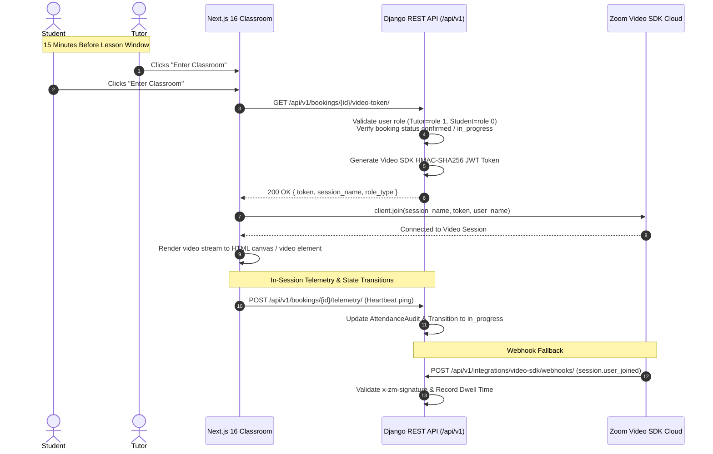

# Zoom Video SDK Architectural Migration Plan

**Document ID:** `PLAN-2026-ZOOM-V-SDK`  
**Status:** Approved Architectural Decision (Decision **D-9** Resolved)  
**Date:** October 05, 2026  
**Architect:** Lead Architect & Orchestrator  
**Applicability:** Antigravity (Gemini), Claude Code, Codex, Human Engineering Lead (Anesu MUPESA)

---

## 1. Executive Summary & Problem Resolution

### 1.1 The Problem: Zoom Meetings Host Collisions (Decision D-9)
The original platform specification utilized the **Zoom Meetings Server-to-Server (S2S) OAuth API**. Under Zoom's standard meetings infrastructure, each meeting is bound to a single **Licensed Host User** ($15.99–$19.99/user/month). 

Crucially, **Zoom enforces a strict limit: one licensed host account cannot host more than one active meeting at the same time**.

In a language marketplace where multiple tutors conduct 25-minute lessons simultaneously, this created a critical architectural bottleneck:
- **Single Host (Current Code Default):** Only **1 lesson** could occur across the entire platform during any 25-minute time window. Concurrent lessons would collide, terminating running classes or locking out the second tutor.
- **Per-Tutor Licensing:** Buying individual Zoom Pro licenses for 50–100 tutors would cost thousands of dollars per month for idle seats.
- **Host Pooling:** Assigning a pool of 3–5 rotating host accounts introduced complex race conditions, scheduling fragility, and license pool exhaustion.
- **Poor User Experience:** Tutors and students were forced to launch an external desktop application (`zoommtg://`), prompt security dialogs, and manage external windows alongside the platform's lesson reader.

### 1.2 The Solution: Zoom Video SDK (In-Browser Classroom)
On **October 05, 2026**, the platform formally resolved **Decision D-9** by approving the transition to the **Zoom Video SDK** (`@zoom/videosdk`):

1. **Embedded In-Browser Experience:** Lessons run **100% inside the browser** on `sharonesl.com/student/classroom/[id]` and `/teacher/classroom/[id]`. No app downloads, no external redirects, no Zoom user accounts required.
2. **Infinite Concurrency:** There is **no concept of a "Host User" or seat licenses**. 100 simultaneous 1-on-1 lessons can run at the exact same minute without collision or extra seat costs.
3. **Usage-Based Marketplace Economics:**
   - **First 10,000 participant minutes per month are 100% free** (~200 free 25-minute lessons every month).
   - Subsequent usage is billed at a flat **$0.0035 per participant minute** (cost per 25-minute 1-on-1 class = $0.175, or less than 2% of a $9.00 lesson).
   - If no lessons occur in a given week, Sharon pays **$0**.
4. **Anti-Disintermediation Defense:** Tutors and students never exchange personal Zoom links or see personal account emails, preventing relationship poaching.
5. **Precise In-App Attendance:** WebRTC connection events are captured natively in the browser, providing millisecond-accurate telemetry for the 20-minute escrow release rule.

---

## 2. Legacy Zoom Structure: Deprecation & Stale Modules

All AI agents and developers working on the repository must observe the following deprecation notices:

> [!WARNING]
> **STALE / DEPRECATED COMPONENTS (DO NOT EXPAND OR RELY ON FOR NEW FEATURES):**
> 1. `apps/integrations/zoom.py`: S2S meeting provisioning (`create_meeting`, S2S token cache).
> 2. `apps/integrations/zoom_hosts.py`: `HostPicker` single/pooled host selector.
> 3. `apps/bookings/services/host_link.py` & `apps/bookings/host_link_views.py`: Ephemeral ZAK host link retrieval (`GET /bookings/<id>/host-link/`).
> 4. `apps/bookings/models.py`: Fields `Booking.zoom_meeting_id`, `zoom_host_user_id`, and `zoom_start_url` (marked deprecated; will be superseded by `video_session_name`).
> 5. `frontend/src/components/classroom/ZoomLauncherButton.tsx`: External app launcher button.
> 6. `frontend/src/lib/hostLink.ts`: Client-side host link polling helper.

*Note: Existing tests for these legacy components will remain temporarily green until the new Video SDK components are introduced, after which the legacy paths will be retired cleanly.*

---

## 3. Target Zoom Video SDK Architecture



### 3.1 Backend Components (`Project-files/backend/`)

1. **Configuration Settings (`config/settings/base.py` & `guard.py`)**:
   - `ZOOM_VIDEO_SDK_KEY`: Zoom Video SDK App Key (from Zoom Marketplace).
   - `ZOOM_VIDEO_SDK_SECRET`: Zoom Video SDK App Secret (used to sign session JWTs).
   - `ZOOM_VIDEO_SDK_WEBHOOK_SECRET`: Secret token for validating Video SDK event webhooks.
2. **Video SDK Token Service (`apps/integrations/services/video_sdk.py`)**:
   - Generates a standard Video SDK JWT conforming to Zoom's specification:
     ```json
     {
       "app_key": "YOUR_VIDEO_SDK_KEY",
       "version": 1,
       "user_identity": "<user_uuid>",
       "iat": 1696500000,
       "exp": 1696507200,
       "tpc": "lesson-<booking_uuid>",
       "role_type": 1, 
       "cloud_recording_option": 0
     }
     ```
   - `role_type = 1` for Tutors (Host privileges).
   - `role_type = 0` for Students (Participant privileges).
   - `tpc` (topic / session name): Deterministic booking identifier `lesson-{booking.id}`.
   - `cloud_recording_option = 0` (enforcing Decision D-8: no recording).
3. **Session Token Endpoint (`apps/bookings/video_views.py`)**:
   - `GET /api/v1/bookings/<id>/video-token/`:
     - Available from $T-15\text{m}$ until lesson scheduled end time.
     - Enforces RBAC: Only the assigned tutor, assigned student, or superuser/admin can request a token.
     - Returns `{ token, session_name, user_identity, user_name, role_type }`.
4. **Attendance Telemetry Ingestion (`apps/integrations/views/video_webhooks.py`)**:
   - Listens to Zoom Video SDK Webhooks (`session.started`, `session.ended`, `session.user_joined`, `session.user_left`).
   - Uses timing-safe HMAC signature verification.
   - Updates `AttendanceAudit` with actual dwell minutes.
   - T+10m probe checks if session has active participants or if tutor failed to join.

---

### 3.2 Frontend Components (`Project-files/frontend/`)

1. **Dependencies**:
   - Install `@zoom/videosdk` (official npm package).
2. **Classroom Video Component (`src/components/classroom/VideoSdkClassroom.tsx`)**:
   - Initializes `ZoomVideo.createClient()`.
   - Manages media streams (`stream.startAudio()`, `stream.startVideo()`, `stream.renderVideo()`).
   - Handles device selection (switching mics, webcams, speakers).
   - Provides clean, custom branded UI controls:
     - Mute/Unmute microphone.
     - Start/Stop camera.
     - Screen share toggle.
     - Network quality & connection latency indicator.
3. **Integration with Classroom Layout (`ClassroomSplitLayout.tsx`)**:
   - Replaces the legacy `ZoomLauncherButton` in:
     - `/student/classroom/[id]/page.tsx`
     - `/teacher/classroom/[id]/page.tsx`
   - Supports 3 view modes:
     - **Split View (50/50)**: Tutor video on left, interactive lesson material/PDF on right.
     - **Video Focus**: Maximized video feed for open conversation / FreeTalk lessons.
     - **Material Focus**: Maximized lesson reader with picture-in-picture (PiP) video thumbnail.

---

## 4. Phase-by-Phase Implementation Plan

> [!NOTE]
> Implementation will proceed under **Phase 12 (Integrations)**. The existing codebase remains 100% operational in local mock mode until this plan is triggered.

| Sprint Slice | Target Scope | Key Deliverables & Test Criteria |
| :--- | :--- | :--- |
| **Slice V1 (Backend Token Service)** | JWT Token Engine & Settings Guard | • Create `apps/integrations/services/video_sdk.py`.<br/>• Unit tests validating HMAC-SHA256 signature, expiration, and role mapping (tutor=1, student=0).<br/>• Add `ZOOM_VIDEO_SDK_*` to settings guard. |
| **Slice V2 (Backend Token Endpoint)** | Session Token API | • Create `GET /api/v1/bookings/<id>/video-token/`.<br/>• Add 15-minute time window validation and IDOR defense.<br/>• Integration tests covering student, tutor, and unauthorized caller access. |
| **Slice V3 (Frontend SDK Integration)** | Next.js Classroom Component | • Install `@zoom/videosdk`.<br/>• Build `VideoSdkClassroom.tsx` with canvas rendering and WebRTC device management.<br/>• Integrate into `/student/classroom/[id]` and `/teacher/classroom/[id]`. |
| **Slice V4 (Attendance Telemetry)** | Webhook & In-Session Telemetry | • Update `AttendanceAudit` to track Video SDK session durations.<br/>• Ingest Video SDK webhooks or client-side heartbeats for the $\ge 20$-minute completion rule. |
| **Slice V5 (Legacy Cleanup)** | Deprecation & Migration | • Deprecate `HostPicker`, `zoom_hosts.py`, `HostLinkView`, and `ZoomLauncherButton`.<br/>• Database migration to retire legacy meeting ID and start URL columns. |

---

## 5. Zoom Credentials and Webhook Configuration Runbook

This section records the current Zoom state and the exact work to complete once the
backend has a public HTTPS URL. Secrets must never be committed to this repository
or written into documentation.

### 5.1 What is already available

The authenticated Zoom account already has a Video SDK project in Platform Studio:

- Project: `sharon esther Build Project 0001`.
- The project's SDK key is already present in the local ignored `.env` file as
  `ZOOM_VIDEO_SDK_KEY`.
- The matching SDK secret is already present in the local ignored `.env` file as
  `ZOOM_VIDEO_SDK_SECRET`.
- Platform Studio's **Event subscriptions** page currently redirects to the
  project's legacy Marketplace app page. This is the supported configuration
  location at present.
- The legacy app page already exposes a **Secret Token**. It is available in Zoom,
  but it has not yet been copied into the local environment.
- The legacy app page also exposes API key fields. They are not required for the
  normal webhook setup and must not be added to the application unless API-based
  subscription automation is explicitly chosen.
- The legacy **Event Subscription** switch is currently disabled.

### 5.2 What is still required from Sharon

Provide or approve a public HTTPS backend URL that Zoom can reach. A local URL such
as `localhost:3000`, `localhost:8000`, or a private LAN address cannot pass Zoom's
webhook validation. The intended production endpoint is:

```text
https://api.sharonesl.com/api/v1/integrations/video-sdk/webhooks/
```

If that domain is not ready, use the final deployed staging URL instead and record
the environment clearly. Do not enable the Zoom subscription until the URL returns
over HTTPS and the endpoint is reachable from the public internet.

### 5.3 Configuration procedure once the URL exists

1. Deploy the backend and confirm the endpoint is reachable over public HTTPS.
2. Confirm the endpoint accepts Zoom's `endpoint.url_validation` challenge and
   returns the required `plainToken` and HMAC `encryptedToken` response.
3. In Platform Studio, open **Event subscriptions** and follow **Manage event
   subscriptions** to the legacy Marketplace app page.
4. Enable **Event Subscription**.
5. Add a webhook subscription with the public endpoint URL above.
6. Select these Video SDK events:
   - `session.started`
   - `session.ended`
   - `session.user_joined`
   - `session.user_left`
7. Run Zoom's **Validate** action and save only after validation succeeds.
8. Copy the Zoom Secret Token directly into the deployment secret store as:

   ```text
   ZOOM_VIDEO_SDK_WEBHOOK_SECRET=<value stored outside git>
   ```

   The code falls back to `ZOOM_WEBHOOK_SECRET_TOKEN` for compatibility, but the
   dedicated `ZOOM_VIDEO_SDK_WEBHOOK_SECRET` variable is preferred because it makes
   the Video SDK boundary explicit.
9. Restart the backend and run a signed webhook smoke test. Verify that invalid
   signatures, stale timestamps, duplicate events, and the URL-validation challenge
   behave as expected.
10. Join and end a real test classroom session, then verify the four event types,
    attendance minutes, booking state transitions, and idempotent replay behavior.

### 5.4 Why the legacy UI is the selected approach

Zoom's current Platform Studio explicitly directs this project to the legacy
Marketplace app page for event subscriptions. The REST API can manage event
subscriptions, but it still requires the same public endpoint, validation, signing
secret, and event selection. The UI is therefore the shortest and safest initial
setup path; API automation can be considered later after the first subscription is
working and has been verified.

### 5.5 Completion gates

This integration is not production-ready until all of the following are true:

- The endpoint is publicly reachable over HTTPS.
- Zoom URL validation succeeds.
- The Secret Token is stored in the deployment secret manager and is not committed.
- The four required event types are enabled.
- A real session produces signed webhook deliveries.
- Backend tests and a real end-to-end attendance check pass.
- The deployment logs show no missing-secret or signature-validation errors.

---

## 6. Collaboration Directives for AI Agents

1. **Claude Code / Codex / Antigravity**:
   - Treat `Project-files/docs/ZOOM_ATTENDANCE.md` (legacy S2S section) as **STALE**.
   - Do NOT generate code referencing `HostPicker`, `zoom_start_url`, or Zoom Meetings user licenses.
   - When asked about video conferencing, reference this document (`ZOOM_VIDEO_SDK_MIGRATION_PLAN.md`).
   - Status as of 2026-10-07: **V1-V4 are implemented and merged on `develop`** (the lead's 2026-10-05 chat message was taken as the go; see `PHASE_11_12_TASK_ASSIGNMENTS.md` §0). **V5 (retire the legacy Meetings columns and files) is still NOT authorized**: do not implement it until Anesu says so explicitly after a real Zoom Video SDK session has been exercised. V1-V4 have never run against real Zoom (see `GAP_ANALYSIS_AND_LAUNCH_TIMELINE_2026-10-07.md` §2e).
