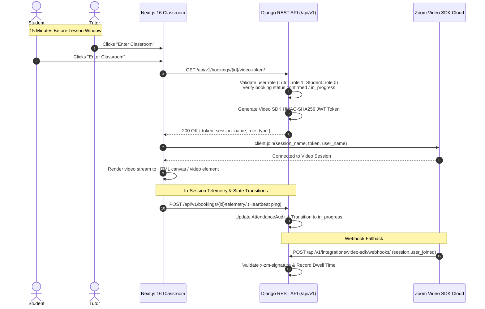

# Zoom Video SDK Architectural Migration Plan

**Document ID:** `PLAN-2026-ZOOM-V-SDK`  
**Status:** Approved Architectural Decision (Decision **D-9** Resolved)  
**Date:** October 05, 2026  
**Architect:** Lead Architect & Orchestrator  
**Applicability:** Antigravity (Gemini), Claude Code, Codex, Human Engineering Lead (Anesu MUPESA)

---

## 1. Executive Summary & Problem Resolution

### 1.1 The Problem: Zoom Meetings Host Collisions (Decision D-9)
The original platform specification utilized the **Zoom Meetings Server-to-Server (S2S) OAuth API**. Under Zoom's standard meetings infrastructure, each meeting is bound to a single **Licensed Host User** ($15.99–$19.99/user/month). 

Crucially, **Zoom enforces a strict limit: one licensed host account cannot host more than one active meeting at the same time**.

In a language marketplace where multiple tutors conduct 25-minute lessons simultaneously, this created a critical architectural bottleneck:
- **Single Host (Current Code Default):** Only **1 lesson** could occur across the entire platform during any 25-minute time window. Concurrent lessons would collide, terminating running classes or locking out the second tutor.
- **Per-Tutor Licensing:** Buying individual Zoom Pro licenses for 50–100 tutors would cost thousands of dollars per month for idle seats.
- **Host Pooling:** Assigning a pool of 3–5 rotating host accounts introduced complex race conditions, scheduling fragility, and license pool exhaustion.
- **Poor User Experience:** Tutors and students were forced to launch an external desktop application (`zoommtg://`), prompt security dialogs, and manage external windows alongside the platform's lesson reader.

### 1.2 The Solution: Zoom Video SDK (In-Browser Classroom)
On **October 05, 2026**, the platform formally resolved **Decision D-9** by approving the transition to the **Zoom Video SDK** (`@zoom/videosdk`):

1. **Embedded In-Browser Experience:** Lessons run **100% inside the browser** on `sharonesl.com/student/classroom/[id]` and `/teacher/classroom/[id]`. No app downloads, no external redirects, no Zoom user accounts required.
2. **Infinite Concurrency:** There is **no concept of a "Host User" or seat licenses**. 100 simultaneous 1-on-1 lessons can run at the exact same minute without collision or extra seat costs.
3. **Usage-Based Marketplace Economics:**
   - **First 10,000 participant minutes per month are 100% free** (~200 free 25-minute lessons every month).
   - Subsequent usage is billed at a flat **$0.0035 per participant minute** (cost per 25-minute 1-on-1 class = $0.175, or less than 2% of a $9.00 lesson).
   - If no lessons occur in a given week, Sharon pays **$0**.
4. **Anti-Disintermediation Defense:** Tutors and students never exchange personal Zoom links or see personal account emails, preventing relationship poaching.
5. **Precise In-App Attendance:** WebRTC connection events are captured natively in the browser, providing millisecond-accurate telemetry for the 20-minute escrow release rule.

---

## 2. Legacy Zoom Structure: Deprecation & Stale Modules

All AI agents and developers working on the repository must observe the following deprecation notices:

> [!WARNING]
> **STALE / DEPRECATED COMPONENTS (DO NOT EXPAND OR RELY ON FOR NEW FEATURES):**
> 1. `apps/integrations/zoom.py`: S2S meeting provisioning (`create_meeting`, S2S token cache).
> 2. `apps/integrations/zoom_hosts.py`: `HostPicker` single/pooled host selector.
> 3. `apps/bookings/services/host_link.py` & `apps/bookings/host_link_views.py`: Ephemeral ZAK host link retrieval (`GET /bookings/<id>/host-link/`).
> 4. `apps/bookings/models.py`: Fields `Booking.zoom_meeting_id`, `zoom_host_user_id`, and `zoom_start_url` (marked deprecated; will be superseded by `video_session_name`).
> 5. `frontend/src/components/classroom/ZoomLauncherButton.tsx`: External app launcher button.
> 6. `frontend/src/lib/hostLink.ts`: Client-side host link polling helper.

*Note: Existing tests for these legacy components will remain temporarily green until the new Video SDK components are introduced, after which the legacy paths will be retired cleanly.*

---

## 3. Target Zoom Video SDK Architecture



### 3.1 Backend Components (`Project-files/backend/`)

1. **Configuration Settings (`config/settings/base.py` & `guard.py`)**:
   - `ZOOM_VIDEO_SDK_KEY`: Zoom Video SDK App Key (from Zoom Marketplace).
   - `ZOOM_VIDEO_SDK_SECRET`: Zoom Video SDK App Secret (used to sign session JWTs).
   - `ZOOM_VIDEO_SDK_WEBHOOK_SECRET`: Secret token for validating Video SDK event webhooks.
2. **Video SDK Token Service (`apps/integrations/services/video_sdk.py`)**:
   - Generates a standard Video SDK JWT conforming to Zoom's specification:
     ```json
     {
       "app_key": "YOUR_VIDEO_SDK_KEY",
       "version": 1,
       "user_identity": "<user_uuid>",
       "iat": 1696500000,
       "exp": 1696507200,
       "tpc": "lesson-<booking_uuid>",
       "role_type": 1, 
       "cloud_recording_option": 0
     }
     ```
   - `role_type = 1` for Tutors (Host privileges).
   - `role_type = 0` for Students (Participant privileges).
   - `tpc` (topic / session name): Deterministic booking identifier `lesson-{booking.id}`.
   - `cloud_recording_option = 0` (enforcing Decision D-8: no recording).
3. **Session Token Endpoint (`apps/bookings/video_views.py`)**:
   - `GET /api/v1/bookings/<id>/video-token/`:
     - Available from $T-15\text{m}$ until lesson scheduled end time.
     - Enforces RBAC: Only the assigned tutor, assigned student, or superuser/admin can request a token.
     - Returns `{ token, session_name, user_identity, user_name, role_type }`.
4. **Attendance Telemetry Ingestion (`apps/integrations/views/video_webhooks.py`)**:
   - Listens to Zoom Video SDK Webhooks (`session.started`, `session.ended`, `session.user_joined`, `session.user_left`).
   - Uses timing-safe HMAC signature verification.
   - Updates `AttendanceAudit` with actual dwell minutes.
   - T+10m probe checks if session has active participants or if tutor failed to join.

---

### 3.2 Frontend Components (`Project-files/frontend/`)

1. **Dependencies**:
   - Install `@zoom/videosdk` (official npm package).
2. **Classroom Video Component (`src/components/classroom/VideoSdkClassroom.tsx`)**:
   - Initializes `ZoomVideo.createClient()`.
   - Manages media streams (`stream.startAudio()`, `stream.startVideo()`, `stream.renderVideo()`).
   - Handles device selection (switching mics, webcams, speakers).
   - Provides clean, custom branded UI controls:
     - Mute/Unmute microphone.
     - Start/Stop camera.
     - Screen share toggle.
     - Network quality & connection latency indicator.
3. **Integration with Classroom Layout (`ClassroomSplitLayout.tsx`)**:
   - Replaces the legacy `ZoomLauncherButton` in:
     - `/student/classroom/[id]/page.tsx`
     - `/teacher/classroom/[id]/page.tsx`
   - Supports 3 view modes:
     - **Split View (50/50)**: Tutor video on left, interactive lesson material/PDF on right.
     - **Video Focus**: Maximized video feed for open conversation / FreeTalk lessons.
     - **Material Focus**: Maximized lesson reader with picture-in-picture (PiP) video thumbnail.

---

## 4. Phase-by-Phase Implementation Plan

> [!NOTE]
> Implementation will proceed under **Phase 12 (Integrations)**. The existing codebase remains 100% operational in local mock mode until this plan is triggered.

| Sprint Slice | Target Scope | Key Deliverables & Test Criteria |
| :--- | :--- | :--- |
| **Slice V1 (Backend Token Service)** | JWT Token Engine & Settings Guard | • Create `apps/integrations/services/video_sdk.py`.<br/>• Unit tests validating HMAC-SHA256 signature, expiration, and role mapping (tutor=1, student=0).<br/>• Add `ZOOM_VIDEO_SDK_*` to settings guard. |
| **Slice V2 (Backend Token Endpoint)** | Session Token API | • Create `GET /api/v1/bookings/<id>/video-token/`.<br/>• Add 15-minute time window validation and IDOR defense.<br/>• Integration tests covering student, tutor, and unauthorized caller access. |
| **Slice V3 (Frontend SDK Integration)** | Next.js Classroom Component | • Install `@zoom/videosdk`.<br/>• Build `VideoSdkClassroom.tsx` with canvas rendering and WebRTC device management.<br/>• Integrate into `/student/classroom/[id]` and `/teacher/classroom/[id]`. |
| **Slice V4 (Attendance Telemetry)** | Webhook & In-Session Telemetry | • Update `AttendanceAudit` to track Video SDK session durations.<br/>• Ingest Video SDK webhooks or client-side heartbeats for the $\ge 20$-minute completion rule. |
| **Slice V5 (Legacy Cleanup)** | Deprecation & Migration | • Deprecate `HostPicker`, `zoom_hosts.py`, `HostLinkView`, and `ZoomLauncherButton`.<br/>• Database migration to retire legacy meeting ID and start URL columns. |

---

## 5. What Sharon Needs to Provide (Zoom Marketplace Setup)

To configure the Zoom Video SDK, Sharon needs to create a **Video SDK App** in the Zoom App Marketplace:

1. **Sign in to Zoom Marketplace**: Navigate to [marketplace.zoom.us](https://marketplace.zoom.us/) using `sharonremotedeveloper@gmail.com`.
2. **Create Video SDK App**:
   - Click **Develop** $\rightarrow$ **Build App**.
   - Choose **Video SDK** (do *not* choose Server-to-Server OAuth or Meeting SDK).
   - Enter App Name: `Sharon Online Classroom Engine`.
3. **Copy Credentials**:
   - **SDK Key**: (32-character string).
   - **SDK Secret**: (Secret key used for JWT signing).
4. **Configure Event Subscriptions (Webhooks)**:
   - Add endpoint URL: `https://api.sharonesl.com/api/v1/integrations/video-sdk/webhooks/`.
   - Subscribe to events: `session.started`, `session.ended`, `session.user_joined`, `session.user_left`.
   - Copy **Secret Token** for webhook HMAC signature verification.

---

## 6. Collaboration Directives for AI Agents

1. **Claude Code / Codex / Antigravity**:
   - Treat `Project-files/docs/ZOOM_ATTENDANCE.md` (legacy S2S section) as **STALE**.
   - Do NOT generate code referencing `HostPicker`, `zoom_start_url`, or Zoom Meetings user licenses.
   - When asked about video conferencing, reference this document (`ZOOM_VIDEO_SDK_MIGRATION_PLAN.md`).
   - Do NOT implement Phase 12-V1 through V5 until explicitly authorized by the project lead (Anesu MUPESA).
